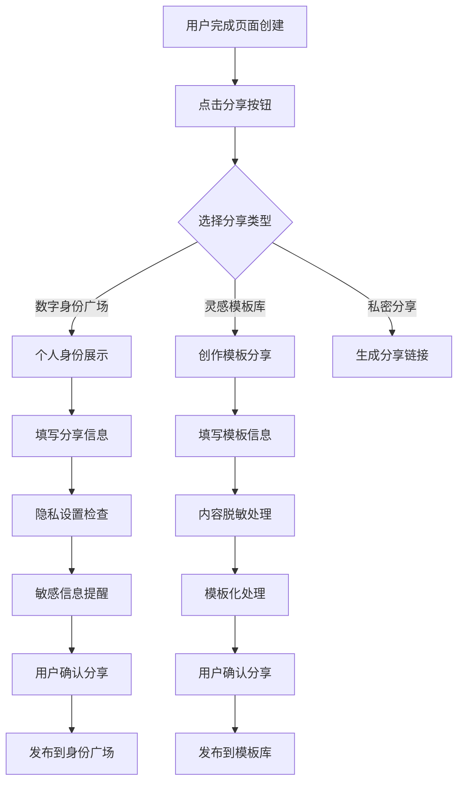

# HeysMe 社区功能设计文档

## 概述

HeysMe 作为 AI 原生的数字身份平台，需要构建两个核心社区功能来促进用户互动、内容发现和创作灵感：

1. **数字身份广场（People Explorer）** - 展示用户创建的身份页面
2. **灵感模板库（Template Hub）** - 提供可复用的页面模板和创作灵感

---

## 1. 数字身份广场（People Explorer）

### 1.1 产品定位

**核心价值**：数字名片集合 + 意图型广场，让用户发现其他人的身份页面，促进连接与合作

**目标用户**：
- 求职者：寻找工作机会或展示自己
- 招聘者：发现人才
- 合作寻求者：寻找项目伙伴
- 投资人/被投资人：寻找投资机会
- 服务提供者：展示专业服务
- KOL/个人品牌：展示影响力，建立个人品牌
- 内容创作者：展示作品，吸引粉丝关注

### 1.2 功能设计

#### 1.2.1 页面布局结构

```
┌─────────────────────────────────────────────────────┐
│ 顶部搜索与筛选区域                                    │
├─────────────────────────────────────────────────────┤
│ [搜索框] [分类筛选] [高级筛选] [排序]                │
├─────────────────────────────────────────────────────┤
│ 主体展示区域（瀑布流/网格布局）                      │
│ ┌─────┐ ┌─────┐ ┌─────┐ ┌─────┐                    │
│ │卡片1│ │卡片2│ │卡片3│ │卡片4│                    │
│ └─────┘ └─────┘ └─────┘ └─────┘                    │
└─────────────────────────────────────────────────────┘
```

#### 1.2.2 名片卡片设计

每张卡片包含以下信息：

| 信息项 | 描述 | 示例 |
|--------|------|------|
| **页面缩略图** | 自动生成的页面视觉预览 | 页面截图缩略图 |
| **昵称/标题** | 用户自定义身份页标题 | "资深产品经理寻找远程机会" |
| **目标标签** | 用户意图分类标签 | #求职 #远程工作 |
| **一句话简介** | 60字限制的个人简介 | "8年B端产品经验，擅长AI产品设计" |
| **行业标签** | 技能或行业分类 | AI/产品设计/SaaS |
| **活跃指标** | 更新时间和热度 | "2天前更新" "被查看156次" |
| **交互按钮** | 查看详情、收藏等操作 | 👁️ 查看页面 ❤️ 收藏 |

#### 1.2.3 搜索与筛选功能

**主分类标签**：
- ✅ 求职
- ✅ 招聘  
- ✅ 寻找合作
- ✅ 寻找投资人/投资机会
- ✅ 托管/运营服务
- ✅ 咨询服务
- ✅ 个人展示/KOL
- ✅ 内容创作者/自媒体
- ✅ 教育辅导
- ✅ 自由职业/开发者
- ✅ 其他

**搜索功能**：
- 实时模糊匹配：昵称、简介关键词、标签
- 智能标签推荐：输入关键词自动推荐相关标签
- 搜索历史记录

**高级筛选**：
- 按更新时间/受欢迎程度排序
- 行业标签筛选：设计/编程/咨询/教育/健康/营销等
- 地区筛选（可选）
- 是否匿名展示

#### 1.2.4 展示型用户特殊考虑

**个人展示/KOL 类型用户的特点**：
- **主要目标**：建立个人品牌、展示影响力、吸引关注
- **内容特色**：更注重视觉效果、个人故事、成就展示
- **互动需求**：希望获得更多曝光和关注，而非具体合作
- **展示重点**：粉丝数量、媒体报道、个人成就、作品集等

**针对性设计**：
- 卡片可显示"关注者数量"或"影响力指标"
- 支持"关注"而非"联系"的交互方式
- 可展示社交媒体链接（微博、小红书、抖音等）
- 提供"个人故事"或"成长轨迹"展示区域

### 1.3 交互设计

#### 1.3.1 卡片交互
- **Hover 效果**：鼠标悬停显示更多信息预览
- **点击行为**：点击卡片进入用户详情页
- **收藏功能**：一键收藏感兴趣的用户
- **分享功能**：生成分享链接

#### 1.3.2 筛选交互
- 支持多选分类标签
- 筛选条件持久化（URL参数）
- 快速清除筛选条件
- 筛选结果数量显示

---

## 2. 灵感模板库（Template Hub）

### 2.1 产品定位

**核心价值**：Prompt + 页面的共创空间，降低用户创作门槛，提供高质量模板和创作灵感

**目标用户**：
- 新手用户：需要参考和模板
- 创作者：分享模板获得认可
- 专业用户：寻找特定场景模板

### 2.2 功能设计

#### 2.2.1 页面布局结构

```
┌─────────────────────────────────────────────────────┐
│ 顶部导航区域                                        │
├─────────────────────────────────────────────────────┤
│ [搜索框] [分类Tab] [排序选择]                        │
├─────────────────────────────────────────────────────┤
│ 模板展示区域（网格布局）                            │
│ ┌─────┐ ┌─────┐ ┌─────┐ ┌─────┐                    │
│ │模板1│ │模板2│ │模板3│ │模板4│                    │
│ └─────┘ └─────┘ └─────┘ └─────┘                    │
└─────────────────────────────────────────────────────┘
```

#### 2.2.2 模板卡片设计

| 信息项 | 描述 | 示例 |
|--------|------|------|
| **缩略图** | 页面实际视觉展示 | 页面截图 |
| **标题** | 模板名称 | "高级产品经理简历页" |
| **用途标签** | 页面用途分类 | #简历 #高端职位 |
| **创建者信息** | 作者头像+名称 | @设计猫 |
| **热度指标** | Fork数和使用数 | "234人已使用" "89次Fork" |
| **描述** | 适用场景说明 | "适用于年薪30w+的职场精英" |
| **操作按钮** | Fork/预览/查看对话 | Fork 预览 查看Prompt |

#### 2.2.3 分类与搜索

**模板分类（按页面目标）**：
- 📄 简历页
- 🏢 招聘页  
- 💼 咨询介绍页
- 🎨 作品集展示页
- 👨‍🏫 导师推荐页
- 🏪 品牌故事页
- 📝 内容创作页
- 🎯 其他用途

**搜索功能**：
- 关键词搜索：标题、描述、标签
- 作者搜索：按创建者筛选
- 用途联想：输入场景自动推荐相关模板

**排序维度**：
- 🔥 最受欢迎（Fork数量）
- 🆕 最近上传
- 🤖 AI推荐（基于用户历史）
- ⭐ 编辑精选

### 2.3 特色功能

#### 2.3.1 Prompt 展示
- **对话回放**：展示完整的AI对话过程
- **Prompt 模板**：提取可复用的提示词
- **一键运行**：基于模板Prompt快速生成

#### 2.3.2 Fork 机制
- **一键Fork**：复制模板到个人工作区
- **Fork追踪**：显示Fork关系链
- **版本管理**：支持模板版本迭代

#### 2.3.3 创作者体系
- **作者页面**：展示创作者的所有模板
- **贡献统计**：Fork数、使用数、评分
- **认证机制**：专业设计师认证标识

---

## 3. 产品布局建议

### 3.1 桌面端布局

```
┌─────────────────────────────────────────────────────┐
│ 顶部导航栏（Logo / 我的页面 / 设置）                │
├───────────┬─────────────────────────────────────────┤
│ 侧边栏      │ 主体区域                              │
│             │                                       │
│           │ [AI对话框]                            │
│ ● 新建页面  │                                       │
│ ● 我的作品  │                                       │
│ ● 模板库    │ [推荐模板区域 - 横向滑动]             │
│ ● 人物广场  │                                       │
│ ● 设置      │                                       │
└───────────┴─────────────────────────────────────────┘
```

### 3.2 功能入口设计

| 功能 | 建议位置 | 理由 |
|------|----------|------|
| **灵感模板库** | 对话框下方 + 侧边栏 | 与创作强相关，需要便捷访问 |
| **数字身份广场** | 侧边栏独立入口 | 探索性功能，适合专门浏览 |

### 3.3 移动端适配

- **模板推荐**：对话框下方横向滚动卡片
- **人物广场**：底部导航栏独立Tab
- **搜索优化**：支持语音搜索和快速筛选

---

## 4. 技术实现要点

### 4.1 前端技术栈
- **框架**：Next.js 14 (App Router)
- **样式**：TailwindCSS + shadcn/ui
- **动画**：Framer Motion
- **状态管理**：React Context + Hooks
- **组件库**：Magic UI（特效组件）

### 4.2 后端技术栈
- **数据库**：Supabase PostgreSQL
- **认证**：Clerk
- **存储**：Supabase Storage
- **搜索**：PostgreSQL 全文搜索 + 向量搜索

### 4.3 核心数据表设计

```sql
-- 用户身份页面表
CREATE TABLE user_pages (
  id UUID PRIMARY KEY,
  user_id UUID REFERENCES auth.users(id),
  title VARCHAR(200) NOT NULL,
  description TEXT,
  content JSONB,
  category VARCHAR(50),
  tags TEXT[],
  is_public BOOLEAN DEFAULT true,
  view_count INTEGER DEFAULT 0,
  created_at TIMESTAMP DEFAULT NOW(),
  updated_at TIMESTAMP DEFAULT NOW()
);

-- 模板表
CREATE TABLE templates (
  id UUID PRIMARY KEY,
  creator_id UUID REFERENCES auth.users(id),
  title VARCHAR(200) NOT NULL,
  description TEXT,
  content JSONB,
  prompt_history JSONB,
  category VARCHAR(50),
  tags TEXT[],
  fork_count INTEGER DEFAULT 0,
  use_count INTEGER DEFAULT 0,
  is_featured BOOLEAN DEFAULT false,
  created_at TIMESTAMP DEFAULT NOW()
);

-- Fork关系表
CREATE TABLE template_forks (
  id UUID PRIMARY KEY,
  template_id UUID REFERENCES templates(id),
  user_id UUID REFERENCES auth.users(id),
  forked_at TIMESTAMP DEFAULT NOW()
);

-- 收藏表
CREATE TABLE user_favorites (
  id UUID PRIMARY KEY,
  user_id UUID REFERENCES auth.users(id),
  target_type VARCHAR(20), -- 'page' or 'template'
  target_id UUID,
  created_at TIMESTAMP DEFAULT NOW()
);
```

---

## 5. 未来 TODO

### 5.1 Phase 1: 基础功能（MVP）
- [x] 数字身份广场基础页面搭建
- [x] 名片卡片组件开发
- [x] 基础搜索和分类筛选
- [x] 模板库基础页面搭建
- [x] 模板卡片组件开发
- [ ] Fork功能实现

### 5.2 Phase 2: 增强功能
- [ ] AI推荐算法实现
- [ ] 高级搜索功能（标签联想、语音搜索）
- [ ] 用户收藏系统
- [ ] 创作者认证体系
- [ ] 页面浏览统计和热度算法
- [ ] Prompt回放功能

### 5.3 Phase 3: 社交功能
- [ ] 用户关注系统
- [ ] 评论和点赞功能
- [ ] 私信功能
- [ ] 协作邀请机制
- [ ] 内容举报和审核
- [ ] 社区活动和挑战

### 5.4 Phase 4: 高级特性
- [ ] AI智能匹配推荐
- [ ] 个性化首页Feed
- [ ] 多语言支持
- [ ] 移动端原生应用
- [ ] API开放平台
- [ ] 数据分析看板

### 5.5 技术优化
- [ ] 搜索性能优化（Elasticsearch集成）
- [ ] 图片CDN和缩略图优化
- [ ] 无限滚动和虚拟列表
- [ ] PWA支持
- [ ] 缓存策略优化
- [ ] SEO优化

### 5.6 运营功能
- [ ] 内容质量评分系统
- [ ] 反垃圾和安全机制
- [ ] 用户行为分析
- [ ] A/B测试框架
- [ ] 社区运营工具
- [ ] 数据导出功能

---

## 6. 成功指标

### 6.1 用户参与度
- 日活跃用户数（DAU）
- 页面浏览量和停留时间
- 搜索使用频率
- 收藏和Fork行为

### 6.2 内容质量
- 高质量模板比例
- 用户生成内容数量
- 模板复用率
- 用户满意度评分

### 6.3 社区活跃度
- 新用户注册转化率
- 用户留存率（7日、30日）
- 社区互动频率
- 内容分享传播率

---

## 7. 风险与挑战

### 7.1 产品风险
- **内容质量参差不齐**：需要建立内容审核和质量评估机制
- **用户隐私担忧**：提供灵活的隐私设置选项
- **垃圾内容和滥用**：实施反垃圾和举报机制

### 7.2 技术挑战
- **搜索性能**：大量内容的快速检索和推荐
- **图片处理**：缩略图生成和存储优化
- **并发处理**：高并发访问的性能保障

### 7.3 运营挑战
- **社区氛围营造**：建立积极正面的社区文化
- **内容冷启动**：初期优质内容的积累
- **用户教育**：帮助用户理解和使用新功能

---

## 8. 数据获取策略与分享机制

### 8.1 数据获取与隐私保护策略

#### 8.1.1 数据分类与处理原则

**敏感数据（后端存储，前端不展示，付费功能使用）**：
- 真实姓名
- 手机号码
- 邮箱地址
- 身份证号
- 家庭住址
- 具体公司名称
- 具体项目名称
- 银行卡信息
- 详细工作经历
- 薪资信息
- 学历证书信息

**可分享数据（经用户同意后可分享）**：
- 用户自定义昵称/标题
- 职业领域/行业标签
- 技能标签
- 工作经验年限（范围）
- 地区信息（城市级别）
- 个人简介（用户自定义）
- 作品集（非敏感）
- 社交媒体链接

**公开数据（默认可分享）**：
- 页面视觉设计
- 布局结构
- 色彩搭配
- 组件使用方式
- Prompt对话记录（脱敏后）

#### 8.1.2 数据脱敏处理规则

| 原始数据类型 | 脱敏处理方式 | 示例 |
|-------------|-------------|------|
| **公司名称** | 替换为行业+规模 | "腾讯" → "大型互联网公司" |
| **项目名称** | 替换为项目类型 | "微信支付" → "移动支付系统" |
| **具体数字** | 范围化处理 | "年薪50万" → "年薪40-60万" |
| **真实姓名** | 替换为角色名 | "张三" → "产品经理小张" |
| **联系方式** | 完全移除 | 电话、邮箱不显示 |
| **地址信息** | 城市级别 | "北京市朝阳区xxx" → "北京" |

### 8.2 分享机制设计

#### 8.2.1 分享流程设计



#### 8.2.2 分享界面设计

**数字身份广场分享界面**：
```
┌─────────────────────────────────────────┐
│ 分享到数字身份广场                        │
├─────────────────────────────────────────┤
│ 📝 页面标题: [资深产品经理寻找远程机会]    │
│ 🏷️ 目标标签: [#求职] [#远程工作]         │
│ 📄 一句话简介: [8年B端产品经验...]        │
│ 🏢 行业标签: [AI] [产品设计] [SaaS]      │
│ 📍 地区: [北京] [可远程]                 │
│                                         │
│ ⚠️ 隐私提醒:                            │
│ • 真实姓名将被隐藏                       │
│ • 联系方式不会显示                       │
│ • 公司名称将模糊化处理                   │
│                                         │
│ 🔒 隐私设置:                            │
│ ☑️ 允许他人查看我的页面                  │
│ ☑️ 允许他人收藏我的页面                  │
│ ☐ 显示我的用户名                        │
│                                         │
│ [预览效果] [取消] [确认分享]             │
└─────────────────────────────────────────┘
```

**灵感模板库分享界面**：
```
┌─────────────────────────────────────────┐
│ 分享到灵感模板库                          │
├─────────────────────────────────────────┤
│ 📝 模板标题: [高级产品经理简历页]         │
│ 🏷️ 用途标签: [#简历] [#高端职位]         │
│ 📄 适用场景: [适用于年薪30w+的职场精英]   │
│ 🎨 设计风格: [简约商务] [深色主题]        │
│                                         │
│ 🤖 包含内容:                            │
│ ☑️ 页面设计和布局                        │
│ ☑️ 对话记录（已脱敏）                    │
│ ☑️ Prompt模板                           │
│ ☐ 个人信息（将被完全移除）               │
│                                         │
│ 📊 预期效果:                            │
│ • 其他用户可以Fork此模板                 │
│ • 您将获得创作者署名                     │
│ • 模板使用数据将统计到您的贡献           │
│                                         │
│ [预览脱敏效果] [取消] [确认分享]         │
└─────────────────────────────────────────┘
```

### 8.3 数据表结构更新

#### 8.3.1 增强的数据表设计

```sql
-- 用户身份页面表（增强版）
CREATE TABLE user_pages (
  id UUID PRIMARY KEY,
  user_id UUID REFERENCES auth.users(id),
  
  -- 基础信息
  title VARCHAR(200) NOT NULL,
  description TEXT,
  content JSONB,
  
  -- 分享相关
  is_shared_to_plaza BOOLEAN DEFAULT false,
  plaza_share_config JSONB, -- 分享配置
  
  -- 分类和标签
  category VARCHAR(50),
  tags TEXT[],
  industry_tags TEXT[],
  location VARCHAR(100),
  
  -- 隐私设置
  privacy_settings JSONB DEFAULT '{"allow_view": true, "allow_favorite": true, "show_username": false}',
  
  -- 统计信息
  view_count INTEGER DEFAULT 0,
  favorite_count INTEGER DEFAULT 0,
  
  -- 时间戳
  created_at TIMESTAMP DEFAULT NOW(),
  updated_at TIMESTAMP DEFAULT NOW(),
  shared_at TIMESTAMP
);

-- 模板表（增强版）
CREATE TABLE templates (
  id UUID PRIMARY KEY,
  creator_id UUID REFERENCES auth.users(id),
  source_page_id UUID REFERENCES user_pages(id), -- 源页面引用
  
  -- 基础信息
  title VARCHAR(200) NOT NULL,
  description TEXT,
  
  -- 脱敏内容
  sanitized_content JSONB, -- 脱敏后的页面内容
  sanitized_prompt_history JSONB, -- 脱敏后的对话记录
  
  -- 分类和标签
  category VARCHAR(50),
  tags TEXT[],
  design_tags TEXT[], -- 设计风格标签
  
  -- 统计信息
  fork_count INTEGER DEFAULT 0,
  use_count INTEGER DEFAULT 0,
  view_count INTEGER DEFAULT 0,
  
  -- 状态
  is_featured BOOLEAN DEFAULT false,
  status VARCHAR(20) DEFAULT 'published', -- published, pending, rejected
  
  -- 时间戳
  created_at TIMESTAMP DEFAULT NOW(),
  updated_at TIMESTAMP DEFAULT NOW()
);

-- 分享记录表
CREATE TABLE share_records (
  id UUID PRIMARY KEY,
  user_id UUID REFERENCES auth.users(id),
  page_id UUID REFERENCES user_pages(id),
  share_type VARCHAR(20) NOT NULL, -- 'plaza', 'template', 'link'
  share_config JSONB,
  created_at TIMESTAMP DEFAULT NOW()
);

-- 数据脱敏日志表
CREATE TABLE sanitization_logs (
  id UUID PRIMARY KEY,
  template_id UUID REFERENCES templates(id),
  original_fields JSONB, -- 原始敏感字段
  sanitized_fields JSONB, -- 脱敏后字段
  sanitization_rules JSONB, -- 使用的脱敏规则
  created_at TIMESTAMP DEFAULT NOW()
);
```

### 8.4 技术实现要点

#### 8.4.1 数据脱敏服务

```typescript
// 数据脱敏服务接口
interface SanitizationService {
  // 脱敏页面内容
  sanitizePageContent(content: any): Promise<any>;
  
  // 脱敏对话记录
  sanitizePromptHistory(history: any[]): Promise<any[]>;
  
  // 检测敏感信息
  detectSensitiveInfo(text: string): SensitiveInfo[];
  
  // 生成脱敏规则
  generateSanitizationRules(content: any): SanitizationRules;
}

// 敏感信息类型
interface SensitiveInfo {
  type: 'name' | 'phone' | 'email' | 'company' | 'project' | 'address';
  value: string;
  position: { start: number; end: number };
  confidence: number;
}

// 脱敏规则
interface SanitizationRules {
  companyNames: { [key: string]: string };
  projectNames: { [key: string]: string };
  personalNames: { [key: string]: string };
  contactInfo: string[]; // 需要完全移除的字段
}
```

#### 8.4.2 分享流程服务

```typescript
// 分享服务接口
interface ShareService {
  // 分享到身份广场
  shareToPlaza(pageId: string, config: PlazaShareConfig): Promise<ShareResult>;
  
  // 分享到模板库
  shareToTemplateHub(pageId: string, config: TemplateShareConfig): Promise<ShareResult>;
  
  // 生成私密分享链接
  generatePrivateLink(pageId: string, config: PrivateShareConfig): Promise<string>;
  
  // 预览分享效果
  previewShare(pageId: string, shareType: ShareType): Promise<PreviewResult>;
}

// 分享配置
interface PlazaShareConfig {
  title: string;
  description: string;
  category: string;
  tags: string[];
  industryTags: string[];
  location?: string;
  privacySettings: {
    allowView: boolean;
    allowFavorite: boolean;
    showUsername: boolean;
  };
}

interface TemplateShareConfig {
  title: string;
  description: string;
  category: string;
  tags: string[];
  designTags: string[];
  includePromptHistory: boolean;
}
```

### 8.5 用户体验优化

#### 8.5.1 智能提醒机制

- **敏感信息检测**：AI自动检测页面中的敏感信息并提醒用户
- **分享建议**：根据页面内容智能推荐分享类型和标签
- **隐私评估**：评估分享内容的隐私风险等级
- **效果预测**：预测分享后可能获得的关注度

#### 8.5.2 分享后管理

- **分享统计**：查看分享内容的浏览、收藏、Fork数据
- **隐私控制**：随时修改分享设置或撤回分享
- **内容更新**：源页面更新时选择是否同步到分享内容
- **互动管理**：管理来自分享内容的互动和联系

---

## 9. 实施优先级

### 9.1 Phase 1: 核心分享功能（MVP）
- [ ] 基础分享界面开发
- [ ] 数据脱敏核心算法
- [ ] 隐私设置功能
- [ ] 分享预览功能

### 9.2 Phase 2: 智能化功能
- [ ] AI敏感信息检测
- [ ] 智能标签推荐
- [ ] 分享效果预测
- [ ] 自动分类建议

### 9.3 Phase 3: 高级管理功能
- [ ] 分享数据统计
- [ ] 批量管理工具
- [ ] 高级隐私控制
- [ ] 分享内容同步

---

## 10. 付费功能与敏感数据应用

### 10.1 敏感数据存储策略

#### 10.1.1 数据存储架构
```sql
-- 敏感信息表（加密存储）
CREATE TABLE user_sensitive_data (
  id UUID PRIMARY KEY,
  user_id UUID REFERENCES auth.users(id),
  
  -- 个人信息（加密存储）
  real_name_encrypted TEXT,
  phone_encrypted TEXT,
  email_encrypted TEXT,
  id_number_encrypted TEXT,
  address_encrypted TEXT,
  
  -- 职业信息（加密存储）
  company_name_encrypted TEXT,
  project_details_encrypted JSONB,
  salary_info_encrypted JSONB,
  education_details_encrypted JSONB,
  work_history_encrypted JSONB,
  
  -- 元数据
  encryption_key_id VARCHAR(50),
  data_completeness_score INTEGER, -- 数据完整度评分
  last_verified_at TIMESTAMP,
  
  created_at TIMESTAMP DEFAULT NOW(),
  updated_at TIMESTAMP DEFAULT NOW()
);

-- 付费功能使用记录表
CREATE TABLE premium_feature_usage (
  id UUID PRIMARY KEY,
  user_id UUID REFERENCES auth.users(id),
  feature_type VARCHAR(50), -- 'contact_info', 'detailed_profile', 'batch_export'
  target_user_id UUID, -- 被查看的用户ID
  credits_consumed INTEGER,
  created_at TIMESTAMP DEFAULT NOW()
);
```

#### 10.1.2 数据安全措施
- **端到端加密**：敏感数据使用AES-256加密存储
- **密钥管理**：使用AWS KMS或类似服务管理加密密钥
- **访问控制**：严格的RBAC权限控制
- **审计日志**：所有敏感数据访问都有详细日志

### 10.2 付费功能设计

#### 10.2.1 联系信息解锁功能

**功能描述**：付费用户可以查看感兴趣用户的真实联系方式

**使用场景**：
- 招聘者想要联系求职者
- 投资人想要联系创业者
- 合作方想要深度沟通

**界面设计**：
```
┌─────────────────────────────────────────┐
│ 👤 产品经理小张                          │
├─────────────────────────────────────────┤
│ 📍 北京 | 💼 8年经验 | 🎯 寻找远程机会    │
│                                         │
│ 📄 公开信息：                           │
│ • 擅长AI产品设计和用户体验               │
│ • 有多个成功产品案例                     │
│ • 熟悉敏捷开发流程                       │
│                                         │
│ 🔒 详细信息（需要解锁）：                │
│ ┌─────────────────────────────────────┐   │
│ │ 💎 解锁联系方式 - 5积分              │   │
│ │ • 真实姓名：张***                   │   │
│ │ • 手机号码：138****8888             │   │
│ │ • 邮箱地址：****@gmail.com          │   │
│ │ • 微信号：****                      │   │
│ │                                     │   │
│ │ [立即解锁] [加入收藏]               │   │
│ └─────────────────────────────────────┘   │
│                                         │
│ 💼 详细履历（需要解锁）：                │
│ ┌─────────────────────────────────────┐   │
│ │ 💎 解锁完整履历 - 10积分             │   │
│ │ • 具体公司名称和项目经历             │   │
│ │ • 详细技能评估和认证                 │   │
│ │ • 薪资期望和福利要求                 │   │
│ │                                     │   │
│ │ [立即解锁] [预约面试]               │   │
│ └─────────────────────────────────────┘   │
└─────────────────────────────────────────┘
```

#### 10.2.2 付费功能层级

| 功能层级 | 费用 | 包含内容 |
|---------|------|----------|
| **基础解锁** | 5积分 | 真实姓名、联系方式 |
| **详细履历** | 10积分 | 完整工作经历、项目详情 |
| **深度档案** | 20积分 | 薪资信息、教育背景、技能认证 |
| **批量导出** | 50积分 | 批量导出多个用户信息 |

#### 10.2.3 积分系统设计

**积分获取方式**：
- 💰 **充值购买**：1元 = 10积分
- 🎁 **新用户赠送**：注册送20积分
- 📝 **完善资料**：完整填写个人信息获得10积分
- 🔄 **分享模板**：每个模板被Fork获得2积分
- 📊 **活跃奖励**：每日登录获得1积分

**积分消耗场景**：
- 查看联系方式：5积分
- 查看详细履历：10积分
- 查看深度档案：20积分
- 批量导出数据：50积分
- 置顶推广页面：30积分/天

### 10.3 商业模式设计

#### 10.3.1 目标用户群体

| 用户类型 | 付费意愿 | 主要需求 | 建议定价 |
|---------|---------|---------|---------|
| **企业HR** | 高 | 批量筛选简历、联系求职者 | 299元/月 |
| **猎头顾问** | 高 | 精准人才搜索、详细背景 | 599元/月 |
| **投资人** | 中高 | 创业者背景调研 | 199元/月 |
| **业务合作** | 中 | 寻找合作伙伴 | 99元/月 |
| **个人用户** | 低 | 偶尔查看感兴趣的人 | 按次付费 |

#### 10.3.2 付费套餐设计

**个人套餐**：
- 💎 **基础版**：99元/月，300积分
- 💎 **专业版**：199元/月，800积分 + 高级搜索
- 💎 **企业版**：599元/月，2000积分 + 批量功能

**企业服务**：
- 🏢 **团队版**：999元/月，支持5个账号
- 🏢 **定制版**：面议，API接入 + 专属服务

### 10.4 技术实现要点

#### 10.4.1 权限控制服务

```typescript
interface PremiumService {
  // 检查用户权限
  checkUserPermission(userId: string, feature: PremiumFeature): Promise<boolean>;
  
  // 消耗积分
  consumeCredits(userId: string, amount: number, reason: string): Promise<boolean>;
  
  // 解锁敏感信息
  unlockSensitiveData(userId: string, targetUserId: string, dataType: DataType): Promise<SensitiveData>;
  
  // 记录使用行为
  logFeatureUsage(userId: string, feature: PremiumFeature, metadata: any): Promise<void>;
}

enum PremiumFeature {
  CONTACT_INFO = 'contact_info',
  DETAILED_PROFILE = 'detailed_profile',
  DEEP_PROFILE = 'deep_profile',
  BATCH_EXPORT = 'batch_export',
  ADVANCED_SEARCH = 'advanced_search'
}

enum DataType {
  CONTACT = 'contact',
  WORK_HISTORY = 'work_history',
  SALARY_INFO = 'salary_info',
  EDUCATION = 'education'
}
```

#### 10.4.2 数据解密服务

```typescript
interface EncryptionService {
  // 加密敏感数据
  encryptSensitiveData(data: any, userId: string): Promise<string>;
  
  // 解密敏感数据
  decryptSensitiveData(encryptedData: string, userId: string): Promise<any>;
  
  // 批量解密（用于付费功能）
  batchDecrypt(encryptedDataList: string[], userId: string): Promise<any[]>;
  
  // 密钥轮换
  rotateEncryptionKey(userId: string): Promise<void>;
}
```

### 10.5 实施优先级

#### 10.5.1 Phase 1: 基础付费功能
- [ ] 敏感数据加密存储
- [ ] 积分系统基础功能
- [ ] 联系信息解锁功能
- [ ] 支付集成（微信/支付宝）

---

## 11. 实施进度记录

### ✅ 已完成功能 (2025-01-27)

#### Phase 1: 基础页面结构 ✅
- **数字身份广场页面** (`/dashboard/people`)
  - 完整的响应式布局设计
  - 搜索和筛选功能界面
  - 用户卡片组件设计
  - 加载状态和骨架屏
  - 模拟数据展示

- **灵感模板库页面** (`/dashboard/templates`)
  - 模板卡片展示界面
  - 分类和排序功能
  - 创建者信息展示
  - Fork和使用统计
  - 精选模板标识

- **导航集成**
  - 侧边栏新增社区功能入口
  - 图标和交互设计
  - 折叠状态适配

#### Phase 2: 核心功能实现 ✅
- **数据库表结构** (`supabase-community-tables.sql`)
  - 用户身份页面表 (user_pages)
  - 敏感信息表 (user_sensitive_data) 
  - 模板表 (templates)
  - 创作者认证表 (creator_verifications)
  - 分享记录表 (share_records)
  - 数据脱敏日志表 (sanitization_logs)
  - Fork关系表 (template_forks)
  - 收藏表 (user_favorites)
  - 付费功能使用记录表 (premium_feature_usage)
  - 用户积分表 (user_credits)
  - 完整的索引、触发器和RLS策略

- **分享功能系统**
  - 分享对话框组件 (`components/dialogs/share-dialog.tsx`)
    - 数字身份广场分享配置
    - 灵感模板库分享配置
    - 私密链接生成
    - 隐私设置和数据脱敏提醒
  - 分享API路由 (`app/api/share/route.ts`)
    - 三种分享类型处理
    - 数据脱敏算法
    - 敏感信息检测和替换
    - 分享记录和日志
  - 聊天页面分享集成 (`components/chat/CodeModeView.tsx`)
    - 代码模式顶部导航栏分享按钮
    - 分享数据收集和处理

- **创作者认证系统**
  - 认证申请对话框 (`components/dialogs/creator-verification-dialog.tsx`)
    - 四步认证流程
    - 多种认证类型（设计师、开发者、专家、企业）
    - 专业领域选择
    - 作品集和案例上传
    - 社交媒体链接验证
  - 认证API路由 (`app/api/creator-verification/route.ts`)
    - 认证申请提交
    - 重复申请检查
    - 认证状态查询
  - 模板页面认证入口 (`app/(dashboard)/templates/page.tsx`)
    - 创作者认证横幅
    - 认证申请按钮集成

#### 技术特性
- 使用 Next.js 14 App Router
- 完整的 TypeScript 类型定义
- shadcn/ui 组件库集成
- 响应式设计（移动端适配）
- 加载状态和错误处理
- 现代化的 UI/UX 设计
- 数据安全和隐私保护
- 完整的数据库设计和API架构

### 🔄 下一步计划 (Phase 3)
1. **真实数据集成**
   - 连接数据库表到前端页面
   - 实现真实的搜索和筛选功能
   - 用户页面数据获取和展示

2. **付费功能开发**
   - 积分系统实现
   - 敏感信息解锁功能
   - 支付集成（微信/支付宝）

3. **高级功能**
   - AI推荐算法
   - 个性化首页Feed
   - 社交互动功能

### 📊 开发统计
- **已完成文件**: 8个主要文件
- **代码行数**: 约2000行
- **功能模块**: 6个核心模块
- **数据库表**: 10个表结构
- **API路由**: 2个主要路由

---

*最后更新：2025年1月27日 - Phase 2 完成*