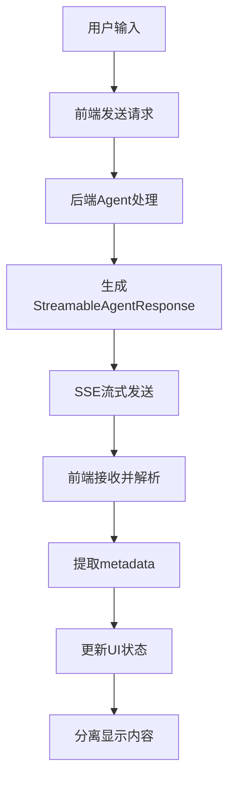

# 流式数据格式约定 - HeysMe项目

## 📋 概述

本文档详细说明了HeysMe项目中大模型API返回的流式数据格式约定，以及前端如何处理这些数据来实现分离显示、流式输出等功能。

## 🔄 数据流架构



## 🎯 核心数据格式

### 1. StreamableAgentResponse 标准格式

```typescript
interface StreamableAgentResponse {
  // 立即显示的内容 - 显示在左侧对话框
  immediate_display?: {
    reply: string;           // 主要文本回复
    thinking?: string;       // 思考过程（可选）
    agent_name?: string;     // Agent名称
    timestamp?: string;      // 时间戳
  };
  
  // 交互式元素 - 按钮、表单等
  interaction?: {
    type: 'choice' | 'input' | 'form' | 'confirmation';
    title?: string;
    description?: string;
    elements: InteractionElement[];
    required?: boolean;
  };
  
  // 系统状态 - 核心控制信息
  system_state?: {
    progress?: number;       // 进度 0-100
    current_stage?: string;  // 当前阶段描述
    intent: string;          // 系统意图标识
    done: boolean;           // 是否完成
    next_agent?: string;     // 下一个Agent
    metadata?: Record<string, any>; // 🔑 关键：扩展元数据
  };
  
  // 会话上下文
  session_context?: {
    user_id?: string;
    session_id: string;
    collected_data?: Record<string, any>;
    user_intent?: UserIntent;
    personalization?: PersonalizationProfile;
  };
}
```

## 🔧 直接代码生成模式格式

### 1. 第一阶段：项目分析响应

```typescript
{
  immediate_display: {
    reply: "🎯 **项目分析完成！**\n\n根据你的需求\"创建个人简历网站\"，我将为你生成一个完整的现代化Web应用。",
    agent_name: "CodingAgent",
    timestamp: "2024-01-20T10:30:00.000Z"
  },
  system_state: {
    intent: "continue",        // 表示还有后续步骤
    done: false,
    progress: 70,
    current_stage: "项目分析完成",
    metadata: {
      testMode: true,          // 🔑 标识测试模式
      analysisComplete: true   // 分析完成标识
    }
  }
}
```

### 2. 第二阶段：代码生成完成响应

```typescript
{
  immediate_display: {
    reply: "✅ **代码生成完成！**\n\n项目已成功生成，包含 8 个文件。右侧预览区域将显示完整的项目代码和实时预览。",
    agent_name: "CodingAgent", 
    timestamp: "2024-01-20T10:31:00.000Z"
  },
  system_state: {
    intent: "test_project_complete",  // 🔑 特殊标识：测试项目完成
    done: true,
    progress: 100,
    current_stage: "代码生成完成",
    metadata: {
      testMode: true,
      projectGenerated: true,
      totalFiles: 8,
      generatedAt: "2024-01-20T10:31:00.000Z",
      userRequest: "创建个人简历网站",
      
      // 🔑 关键：代码文件数据
      projectFiles: [
        {
          filename: "package.json",
          content: "{\n  \"name\": \"personal-resume\",\n  ...",
          description: "Node.js项目配置文件",
          language: "json",
          type: "config"
        },
        {
          filename: "app/page.tsx", 
          content: "import React from 'react';\n\nexport default function HomePage() {\n  ...",
          description: "React主页面组件",
          language: "typescript",
          type: "component"
        }
        // ... 更多文件
      ],
      
      // 🔑 前端识别标识
      hasCodeFiles: true,
      codeFilesReady: true
    }
  }
}
```

## 📊 Metadata 字段约定

### 1. 通用字段

| 字段名 | 类型 | 用途 | 示例 |
|--------|------|------|------|
| `streaming` | boolean | 是否流式消息 | `true` |
| `stream_message_id` | string | 流式消息ID | `"msg-1234567890"` |
| `stream_type` | string | 流式类型 | `"start"`, `"delta"`, `"complete"` |
| `is_final` | boolean | 是否最终消息 | `true` |

### 2. 直接代码生成模式专用字段

| 字段名 | 类型 | 用途 | 示例 |
|--------|------|------|------|
| `directCodeGeneration` | boolean | 直接代码生成模式标识 | `true` |
| `awaitingUserInput` | boolean | 等待用户输入 | `true` |
| `projectGenerated` | boolean | 项目已生成 | `true` |
| `projectFiles` | CodeFile[] | 🔑 代码文件数组 | 见下方格式 |
| `hasCodeFiles` | boolean | 包含代码文件 | `true` |
| `codeFilesReady` | boolean | 代码文件就绪 | `true` |
| `totalFiles` | number | 文件总数 | `8` |
| `userRequest` | string | 用户原始需求 | `"创建个人简历网站"` |

### 3. CodeFile 格式约定

```typescript
interface CodeFile {
  filename: string;        // 文件名（含路径）
  content: string;         // 文件内容
  description?: string;    // 文件描述
  language?: string;       // 编程语言
  type?: string;          // 文件类型：'component'|'config'|'style'|'asset'
  size?: number;          // 文件大小（字节）
  lastModified?: string;  // 最后修改时间
}
```

## 🔄 前端处理流程

### 1. 流式数据接收

**文件：** `hooks/use-chat-system-v2.ts`

```typescript
// 关键：保存system_state中的所有metadata
const agentMessage = {
  id: `msg-${Date.now()}-agent-${messageId}`,
  timestamp: new Date(),
  type: 'agent_response' as const,
  agent: chunk.immediate_display.agent_name || 'system',
  content: chunk.immediate_display.reply,  // 文本内容 -> 左侧显示
  metadata: { 
    streaming: isStreaming,
    stream_message_id: messageId,
    stream_type: streamType,
    // 🔧 关键：展开所有metadata，包含projectFiles
    ...(chunk.system_state?.metadata || {})
  }
};
```

### 2. 智能检测代码生成

**文件：** `app/chat/page.tsx`

```typescript
// 检测是否有代码生成相关的消息
const hasCodeGeneration = currentSession.conversationHistory.some(message => 
  // 传统方式
  message.metadata?.systemState?.current_stage === '代码生成中' ||
  message.metadata?.codeBlocks ||
  
  // 🔧 新增：测试模式检测
  message.metadata?.testMode ||
  message.metadata?.projectGenerated ||
  message.metadata?.projectFiles ||
  
  // 🔧 新增：intent状态检测
  message.metadata?.intent === 'test_project_complete' ||
  message.metadata?.intent === 'project_complete'
)

if (hasCodeGeneration) {
  // 自动切换到代码模式
  if (!isCodeMode) {
    setIsCodeMode(true)
  }
  
  // 🔑 提取代码文件
  const projectMessages = currentSession.conversationHistory.filter(msg => 
    msg.metadata?.projectFiles && Array.isArray(msg.metadata.projectFiles)
  )
  
  if (projectMessages.length > 0) {
    const latestProjectMessage = projectMessages[projectMessages.length - 1]
    const extractedCode = latestProjectMessage.metadata?.projectFiles || []
    
    if (extractedCode.length > 0) {
      setGeneratedCode(extractedCode)  // 更新代码状态 -> 右侧显示
    }
  }
}
```

### 3. 分离显示逻辑

```typescript
// 左侧对话框：显示 immediate_display.reply
<MessageBubble 
  message={{
    content: message.content  // 来自 immediate_display.reply
  }}
/>

// 右侧预览区：显示 metadata.projectFiles
<CodePreviewToggle
  files={generatedCode}     // 来自 metadata.projectFiles
  isStreaming={isGenerating}
  previewData={getReactPreviewData()}
/>
```

## 🎯 Intent 状态约定

### 1. 通用Intent状态

| Intent值 | 含义 | 前端行为 |
|----------|------|----------|
| `processing` | 处理中 | 显示加载状态 |
| `thinking` | 思考中 | 显示思考动画 |
| `continue` | 继续处理 | 等待下一步 |
| `user_input_required` | 需要用户输入 | 显示输入框 |
| `complete` | 完成 | 结束当前流程 |

### 2. 代码生成专用Intent

| Intent值 | 含义 | 前端行为 |
|----------|------|----------|
| `project_complete` | 项目生成完成 | 切换代码模式，显示文件 |
| `test_project_complete` | 测试项目完成 | 同上，但保持测试模式 |
| `code_generation` | 代码生成中 | 显示生成进度 |
| `code_update` | 代码更新 | 更新预览区域 |

## 🔧 错误处理约定

### 1. 错误响应格式

```typescript
{
  immediate_display: {
    reply: "❌ 代码生成过程中出现错误，请稍后重试。",
    agent_name: "CodingAgent",
    timestamp: "2024-01-20T10:35:00.000Z"
  },
  system_state: {
    intent: "error",
    done: true,
    progress: 0,
    current_stage: "错误",
    metadata: {
      error: true,
      errorType: "generation_failed",
      errorMessage: "模型响应超时",
      retryable: true,
      errorCode: "TIMEOUT_001"
    }
  }
}
```

### 2. 前端错误处理

```typescript
// 检测错误状态
if (message.metadata?.error) {
  // 显示错误提示
  showErrorNotification(message.metadata.errorMessage)
  
  // 如果可重试
  if (message.metadata?.retryable) {
    showRetryButton()
  }
}
```

## 🚀 扩展约定

### 1. 自定义Agent响应

```typescript
// 自定义Agent可以在metadata中添加特定字段
{
  system_state: {
    intent: "custom_action",
    metadata: {
      customField: "customValue",
      agentSpecificData: {...},
      
      // 遵循命名约定：agent名_字段名
      codingAgent_files: [...],
      designAgent_themes: [...],
      dataAgent_sources: [...]
    }
  }
}
```

### 2. 版本兼容性

```typescript
{
  system_state: {
    metadata: {
      formatVersion: "1.0",  // 格式版本
      compatibility: {
        minFrontendVersion: "1.0.0",
        features: ["streaming", "codeGeneration", "visualEdit"]
      }
    }
  }
}
```

## 📝 最佳实践

### 1. 数据传递原则

1. **immediate_display** 用于立即显示的文本内容
2. **metadata** 用于控制逻辑和数据传递
3. **intent** 用于状态机控制
4. **interaction** 用于用户交互元素

### 2. 性能优化

1. **大文件分块**：超过1MB的代码文件应分块传输
2. **增量更新**：只传输变更的文件
3. **压缩传输**：使用gzip压缩大型数据
4. **缓存策略**：对不变的配置文件使用缓存

### 3. 调试支持

```typescript
{
  system_state: {
    metadata: {
      debug: true,
      debugInfo: {
        processingTime: 1500,  // 处理耗时（毫秒）
        modelTokens: 2048,     // 使用的Token数
        cacheHit: false,       // 是否命中缓存
        agentChain: ["welcome", "info-collection", "coding"]
      }
    }
  }
}
```

## 🔄 总结

这套流式数据格式约定的核心优势：

1. **标准化**：统一的数据格式，便于维护和扩展
2. **灵活性**：通过metadata支持任意扩展字段
3. **分离关注点**：文本显示和数据传递职责分明
4. **流式友好**：支持渐进式数据传输和显示
5. **错误处理**：完善的错误状态和重试机制

通过这套约定，我们实现了：
- **左侧文本显示**：`immediate_display.reply`
- **右侧代码预览**：`metadata.projectFiles`
- **智能状态切换**：`intent` + `metadata` 标识
- **流式用户体验**：渐进式内容展示 