# 测试代码生成系统 - 关键文件说明

## 📁 文件架构概览

```
Heysme/
├── app/chat/page.tsx                    # 主聊天页面 - 核心控制逻辑
├── components/chat/
│   ├── CodeModeView.tsx                 # 代码模式视图 - 分离显示布局
│   ├── ChatSidebar.tsx                  # 侧边栏 - 包含测试代码按钮
│   └── MessageBubble.tsx                # 消息气泡 - 显示对话内容
├── components/editor/
│   ├── CodePreviewToggle.tsx            # 代码预览切换 - 右侧预览区
│   └── WebContainerPreview.tsx          # 容器预览 - 实际渲染
├── hooks/
│   └── use-chat-system-v2.ts            # 聊天系统钩子 - 流式处理
├── lib/agents/coding/
│   └── agent.ts                         # 编码Agent - 后端生成逻辑
└── docs/
    ├── TEST_CODE_GENERATION_SYSTEM.md   # 系统技术文档
    └── TEST_CODE_GENERATION_FILES.md    # 本文件
```

## 🔧 核心文件详解

### 1. `app/chat/page.tsx` - 主控制器

**作用：** 整个聊天系统的主控制器，负责状态管理和模式切换

#### 关键功能实现：

```typescript
// 1. 智能检测代码生成状态
useEffect(() => {
  if (currentSession && currentSession.conversationHistory && currentSession.conversationHistory.length > 0) {
    // 检查是否有代码生成相关的消息
    const hasCodeGeneration = currentSession.conversationHistory.some(message => 
      message.metadata?.testMode ||
      message.metadata?.projectGenerated ||
      message.metadata?.projectFiles ||
      message.metadata?.intent === 'test_project_complete'
    )
    
    if (hasCodeGeneration) {
      if (!isCodeMode) {
        setIsCodeMode(true) // 自动切换到代码模式
      }
      
      // 提取生成的代码文件
      const projectMessages = currentSession.conversationHistory.filter(msg => 
        msg.metadata?.projectFiles && Array.isArray(msg.metadata.projectFiles)
      )
      
      if (projectMessages.length > 0) {
        const latestProjectMessage = projectMessages[projectMessages.length - 1]
        const extractedCode = latestProjectMessage.metadata?.projectFiles || []
        
        if (extractedCode.length > 0 && extractedCode.length !== generatedCode.length) {
          setGeneratedCode(extractedCode)
        }
      }
    }
  }
}, [currentSession, isCodeMode, generatedCode.length])

// 2. 测试模式消息处理
const handleSendMessage = async () => {
  // 检查是否在测试代码生成模式
  const isInTestMode = isCodeMode && currentSession?.conversationHistory?.some(msg => 
    msg.metadata?.testMode && msg.metadata?.awaitingUserInput
  )

  if (isInTestMode) {
    // 添加特殊标识强制使用coding agent
    messageToSend = `[FORCE_AGENT:coding][TEST_MODE]${inputValue}`
    sendOptions = {
      forceAgent: 'coding',
      testMode: true
    }
  }
  
  sendMessage(messageToSend, sendOptions)
}

// 3. 测试代码生成入口
const generateTestCode = async () => {
  setIsCodeMode(true)
  setHasStartedChat(true)
  setGeneratedCode([])

  // 创建测试模式提示消息
  const testModePrompt = `🧪 **测试代码生成模式已启动！**...`
  
  if (session) {
    const testModeMessage = {
      id: `msg-${Date.now()}-testmode`,
      type: 'agent_response' as const,
      content: testModePrompt,
      metadata: {
        testMode: true,
        awaitingUserInput: true  // 关键标识
      }
    }
    session.conversationHistory.push(testModeMessage)
  }
}
```

#### 状态管理：
- `isCodeMode`: 是否在代码模式
- `generatedCode`: 生成的代码文件数组
- `hasStartedChat`: 是否已开始聊天
- `currentSession`: 当前会话数据

---

### 2. `components/chat/CodeModeView.tsx` - 分离显示布局

**作用：** 实现左右分离的界面布局，左侧对话，右侧代码预览

#### 布局结构：

```typescript
export function CodeModeView({
  currentSession,
  generatedCode,
  onSendChatMessage,
  getReactPreviewData
}: CodeModeViewProps) {
  return (
    <div className="flex-1 flex h-full">
      {/* 左侧对话区域 - 1/3 宽度 */}
      <div className="w-1/3 flex flex-col border-r h-full">
        {/* 消息列表 */}
        <div className="flex-1 overflow-hidden min-h-0">
          <ScrollArea className="h-full">
            <div className="py-4">
              {currentSession?.conversationHistory?.map((message: any, index: number) => (
                <MessageBubble
                  key={message.id}
                  message={message}
                  isLast={index === (currentSession?.conversationHistory?.length || 0) - 1}
                  isGenerating={isGenerating}
                />
              ))}
              
              {/* 代码生成完成提示 */}
              {generatedCode.length > 0 && (
                <div className="bg-blue-50 border border-blue-200 rounded-lg p-4">
                  <div className="flex items-center gap-2 mb-2">
                    <CheckCircle className="w-5 h-5 text-blue-600" />
                    <span className="font-medium text-blue-800">代码生成完成</span>
                  </div>
                  <p className="text-blue-700 text-sm">
                    已生成包含 React 组件、样式文件和配置的完整项目代码。
                    右侧可以查看代码和预览效果。
                  </p>
                </div>
              )}
            </div>
          </ScrollArea>
        </div>

        {/* 输入框区域 */}
        <div className="border-t border-gray-100 bg-white p-4 shrink-0">
          <Input
            placeholder="输入修改需求..."
            value={inputValue}
            onChange={(e) => setInputValue(e.target.value)}
            onKeyPress={onKeyPress}
          />
          
          {/* 快捷操作建议 */}
          <div className="mt-3 flex flex-wrap gap-2">
            {["修改配色方案", "调整布局结构", "添加新功能"].map((suggestion) => (
              <Button
                key={suggestion}
                variant="ghost"
                size="sm"
                onClick={() => setInputValue(suggestion)}
              >
                {suggestion}
              </Button>
            ))}
          </div>
        </div>
      </div>

      {/* 右侧代码预览区域 - 2/3 宽度 */}
      <div className="w-2/3 flex flex-col h-full">
        <CodePreviewToggle
          files={generatedCode}                    // 传递代码文件
          isStreaming={isGenerating}
          previewData={getReactPreviewData()}
          onSendMessage={onSendChatMessage}        // 可视化编辑回调
        />
      </div>
    </div>
  );
}
```

#### 关键特性：
- **响应式布局**：左1/3右2/3的固定比例
- **消息滚动**：左侧自动滚动到最新消息
- **快捷建议**：预设的修改建议按钮
- **状态同步**：实时显示代码生成状态

---

### 3. `hooks/use-chat-system-v2.ts` - 流式处理核心

**作用：** 处理与后端的流式通信，管理会话状态

#### 关键修复：

```typescript
// 流式响应处理 - 保存完整的metadata
const handleStreamingResponse = async (response: Response, session: SessionData) => {
  // ... 流式读取逻辑 ...
  
  const agentMessage = {
    id: `msg-${Date.now()}-agent-${messageId}`,
    timestamp: new Date(),
    type: 'agent_response' as const,
    agent: chunk.immediate_display.agent_name || 'system',
    content: chunk.immediate_display.reply,
    metadata: { 
      streaming: isStreaming,
      stream_message_id: messageId,
      stream_type: streamType,
      // 🔧 关键修复：保存system_state中的所有metadata
      ...(chunk.system_state?.metadata || {})  // 这里包含projectFiles等重要数据
    }
  };
  
  session.conversationHistory.push(agentMessage);
  setCurrentSession({ ...session });
}
```

#### 数据流处理：
1. **接收流式数据**：从后端接收SSE流
2. **解析JSON块**：解析每个数据块
3. **更新消息**：实时更新或创建新消息
4. **保存元数据**：确保projectFiles等关键数据被保存
5. **触发更新**：通知前端组件更新

---

### 4. `lib/agents/coding/agent.ts` - 后端生成逻辑

**作用：** 处理代码生成请求，实现分阶段响应

#### 测试模式处理：

```typescript
private async* handleTestMode(
  userInput: string, 
  sessionData: SessionData
): AsyncGenerator<StreamableAgentResponse, void, unknown> {
  
  // 第一阶段：项目分析（文本响应）
  yield this.createResponse({
    immediate_display: {
      reply: `🎯 **项目分析完成！**\n\n根据你的需求"${userInput}"，我将为你生成一个完整的现代化Web应用。`,
      agent_name: this.name,
      timestamp: new Date().toISOString()
    },
    system_state: {
      intent: 'continue',        // 表示还有后续步骤
      done: false,
      progress: 70,
      metadata: {
        testMode: true,
        analysisComplete: true
      }
    }
  });

  // 第二阶段：代码生成
  const testFiles = this.generateTestModeFiles(userInput);

  // 第三阶段：发送代码文件（文本+文件数据）
  yield this.createResponse({
    immediate_display: {
      reply: `✅ **代码生成完成！**\n\n项目已成功生成，包含 ${testFiles.length} 个文件。`,
      agent_name: this.name,
      timestamp: new Date().toISOString()
    },
    system_state: {
      intent: 'test_project_complete',  // 特殊标识
      done: true,
      progress: 100,
      metadata: {
        testMode: true,
        projectGenerated: true,
        totalFiles: testFiles.length,
        projectFiles: testFiles,        // 🔑 关键：代码文件数据
        hasCodeFiles: true,
        codeFilesReady: true
      }
    }
  });
}
```

#### 代码生成：

```typescript
private generateTestModeFiles(userInput: string): CodeFile[] {
  const projectType = this.determineProjectType(userInput);
  const files: CodeFile[] = [];

  // 基础配置文件
  files.push({
    filename: 'package.json',
    content: this.generateTestPackageJson(projectType),
    description: 'Node.js项目配置文件',
    language: 'json'
  });

  // 主要组件文件
  files.push({
    filename: 'app/page.tsx',
    content: this.generateTestMainPage(projectType, userInput),
    description: 'React主页面组件',
    language: 'typescript'
  });

  // ... 更多文件生成逻辑

  return files;
}
```

---

### 5. `components/editor/CodePreviewToggle.tsx` - 代码预览组件

**作用：** 显示代码文件列表和实时预览

#### 核心功能：

```typescript
export function CodePreviewToggle({
  files,                    // 代码文件数组
  isStreaming,             // 是否正在生成
  previewData,             // 预览数据
  onSendMessage            // 可视化编辑回调
}: CodePreviewToggleProps) {
  
  const [viewMode, setViewMode] = useState<ViewMode>('preview');
  const [activeFile, setActiveFile] = useState(files[0]?.filename || '');
  
  // 处理可视化编辑请求
  const handleContentChange = (field: string, value: string) => {
    if (field === 'visual_edit_request' && onSendMessage) {
      onSendMessage(value, { 
        type: 'visual_edit',
        context: 'stagewise'
      });
    }
  };

  return (
    <div className="flex flex-col h-full">
      {/* 文件树和代码编辑器 */}
      {viewMode === 'code' ? (
        <CodeEditorPanel files={files} />
      ) : (
        <WebContainerPreview
          files={files}
          projectName={previewData?.projectName || '项目预览'}
          onContentChange={handleContentChange}
          isEditMode={editMode === 'ai'}
        />
      )}
    </div>
  );
}
```

---

### 6. `components/editor/WebContainerPreview.tsx` - 实际预览渲染

**作用：** 将代码文件转换为可运行的预览

#### 预览生成：

```typescript
// 生成预览HTML
const generatePreviewHTML = () => {
  const appFile = files.find(f => 
    f.filename.includes('App.') || 
    f.filename.includes('page.') ||
    f.type === 'component'
  );
  
  const cssFile = files.find(f => f.filename.includes('.css'));
  
  let componentContent = appFile ? 
    processReactComponent(appFile.content) : 
    generateDefaultApp();
    
  let cssContent = cssFile ? cssFile.content : '';

  return `
<!DOCTYPE html>
<html lang="zh-CN">
<head>
    <meta charset="UTF-8">
    <script src="https://cdn.tailwindcss.com"></script>
    <script crossorigin src="https://unpkg.com/react@18/umd/react.development.js"></script>
    <script crossorigin src="https://unpkg.com/react-dom@18/umd/react-dom.development.js"></script>
    <script src="https://unpkg.com/@babel/standalone/babel.min.js"></script>
    <style>${cssContent}</style>
</head>
<body>
    <div id="root"></div>
    <script type="text/babel">
      ${componentContent}
      const root = ReactDOM.createRoot(document.getElementById('root'));
      root.render(React.createElement(App));
    </script>
</body>
</html>`;
};
```

## 🔄 数据流向图

```mermaid
graph LR
    A[用户输入] --> B[page.tsx检测测试模式]
    B --> C[添加特殊标识]
    C --> D[use-chat-system-v2.ts发送]
    D --> E[coding/agent.ts处理]
    E --> F[分阶段响应]
    F --> G[use-chat-system-v2.ts接收]
    G --> H[保存到conversationHistory]
    H --> I[page.tsx检测代码生成]
    I --> J[提取projectFiles]
    J --> K[更新generatedCode状态]
    K --> L[CodeModeView显示]
    L --> M[CodePreviewToggle渲染]
    M --> N[WebContainerPreview预览]
```



## 🎯 关键设计模式

### 1. 观察者模式
- `useEffect` 监听 `currentSession` 变化
- 自动检测代码生成状态并切换模式

### 2. 策略模式
- 根据 `isInTestMode` 选择不同的消息处理策略
- 不同模式使用不同的Agent

### 3. 管道模式
- 流式数据通过多个处理阶段
- 每个阶段负责特定的数据转换

### 4. 组件组合模式
- 通过props传递数据和回调
- 实现松耦合的组件通信

## 📝 总结

这个系统的核心在于**数据流的精确控制**和**状态的智能同步**：

1. **后端**：通过 `metadata.projectFiles` 传递代码文件
2. **中间层**：通过 `use-chat-system-v2.ts` 保存完整元数据
3. **前端**：通过智能检测自动提取和显示代码
4. **预览**：通过实时渲染提供即时反馈

每个文件都有明确的职责分工，通过标准化的接口进行通信，确保了系统的可维护性和扩展性。 