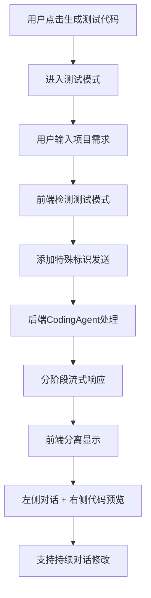
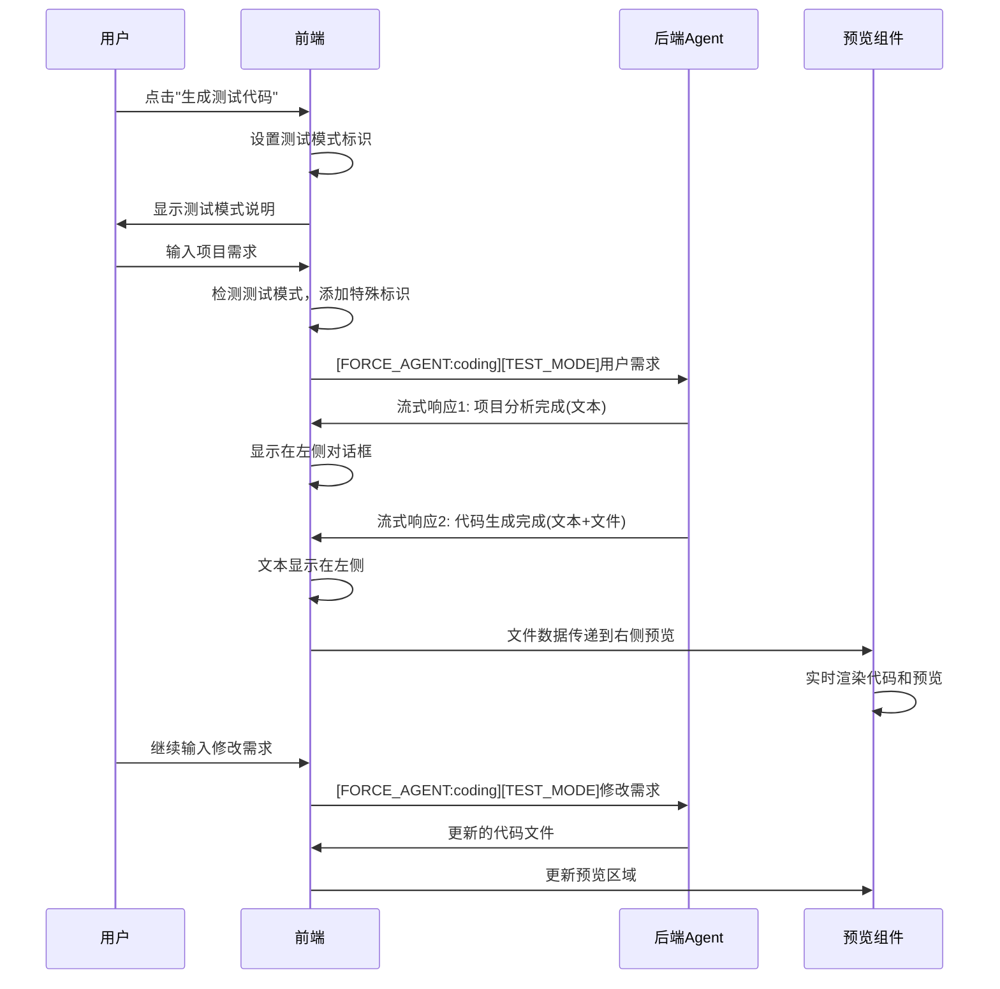

# 测试代码生成系统 - 技术实现文档

## 📋 概述

本文档详细说明了HeysMe项目中测试代码生成系统的核心技术实现，包括分离显示、流式输出、持续对话和智能检测等功能。

## 🏗️ 系统架构



## 🔧 核心功能实现

### 1. 分离显示系统

#### 1.1 前端布局架构

**文件：** `components/chat/CodeModeView.tsx`

```typescript
// 主要布局结构
<div className="flex-1 flex h-full">
  {/* 左侧对话区域 - 1/3 宽度 */}
  <div className="w-1/3 flex flex-col border-r h-full">
    <ScrollArea className="h-full">
      {/* 消息列表 - 显示文本对话 */}
      {currentSession?.conversationHistory?.map((message) => (
        <MessageBubble key={message.id} message={message} />
      ))}
    </ScrollArea>
    {/* 输入框 */}
    <div className="border-t bg-white p-4">
      <Input placeholder="输入修改需求..." />
    </div>
  </div>

  {/* 右侧代码预览区域 - 2/3 宽度 */}
  <div className="w-2/3 flex flex-col h-full">
    <CodePreviewToggle
      files={generatedCode}
      isStreaming={isGenerating}
      previewData={getReactPreviewData()}
    />
  </div>
</div>
```

#### 1.2 数据流分离

**原理：** 通过不同的数据源实现内容分离

```typescript
// 文本内容 -> 左侧对话框
const textContent = response.immediate_display?.reply;

// 代码文件 -> 右侧预览区
const codeFiles = response.system_state?.metadata?.projectFiles;
```

### 2. 流式输出系统

#### 2.1 后端流式响应

**文件：** `lib/agents/coding/agent.ts`

```typescript
private async* handleTestMode(userInput: string, sessionData: SessionData) {
  // 🔧 第一步：发送文本回复（显示在左侧对话框）
  yield this.createResponse({
    immediate_display: {
      reply: `🎯 **项目分析完成！**\n\n根据你的需求"${userInput}"...`,
      agent_name: this.name,
      timestamp: new Date().toISOString()
    },
    system_state: {
      intent: 'continue',
      done: false,
      progress: 70,
      metadata: {
        testMode: true,
        analysisComplete: true
      }
    }
  });

  // 🔧 第二步：生成代码文件
  const testFiles = this.generateTestModeFiles(userInput);

  // 🔧 第三步：发送代码文件（显示在右侧预览区域）
  yield this.createResponse({
    immediate_display: {
      reply: `✅ **代码生成完成！**\n\n项目已成功生成...`,
      agent_name: this.name,
      timestamp: new Date().toISOString()
    },
    system_state: {
      intent: 'test_project_complete',
      done: true,
      progress: 100,
      metadata: {
        testMode: true,
        projectGenerated: true,
        projectFiles: testFiles, // 🔑 关键：代码文件数据
        hasCodeFiles: true,
        codeFilesReady: true
      }
    }
  });
}
```

#### 2.2 前端流式处理

**文件：** `hooks/use-chat-system-v2.ts`

```typescript
// 关键修复：保存system_state中的所有metadata
const agentMessage = {
  id: `msg-${Date.now()}-agent-${messageId}`,
  timestamp: new Date(),
  type: 'agent_response' as const,
  agent: chunk.immediate_display.agent_name || 'system',
  content: chunk.immediate_display.reply,
  metadata: { 
    streaming: isStreaming,
    stream_message_id: messageId,
    stream_type: streamType,
    // 🔧 关键修复：保存system_state中的所有metadata
    ...(chunk.system_state?.metadata || {})
  }
};
```

### 3. 智能检测系统

#### 3.1 测试模式检测

**文件：** `app/chat/page.tsx`

```typescript
// 检测是否有代码生成相关的消息
const hasCodeGeneration = currentSession.conversationHistory.some(message => 
  message.metadata?.systemState?.current_stage === '代码生成中' ||
  message.metadata?.codeBlocks ||
  // 🔧 新增：检查测试模式生成的项目
  message.metadata?.testMode ||
  message.metadata?.projectGenerated ||
  message.metadata?.projectFiles ||
  // 🔧 新增：检查不同的intent状态
  message.metadata?.intent === 'test_project_complete' ||
  message.metadata?.intent === 'project_complete'
)
```

#### 3.2 代码提取逻辑

```typescript
if (hasCodeGeneration) {
  // 🔧 修复：无论是否已在代码模式，都要检查和更新代码
  if (!isCodeMode) {
    setIsCodeMode(true)
  }
  
  // 1. 优先检查最新的项目文件（测试模式）
  const projectMessages = currentSession.conversationHistory.filter(msg => 
    msg.metadata?.projectFiles && Array.isArray(msg.metadata.projectFiles)
  )
  
  if (projectMessages.length > 0) {
    const latestProjectMessage = projectMessages[projectMessages.length - 1]
    extractedCode = latestProjectMessage.metadata?.projectFiles || []
    console.log('🎯 [代码提取] 从projectFiles提取到', extractedCode.length, '个文件')
  }
  
  // 🔧 修复：只有当提取到的代码与当前代码不同时才更新
  if (extractedCode.length > 0 && extractedCode.length !== generatedCode.length) {
    setGeneratedCode(extractedCode)
  }
}
```

### 4. 持续对话系统

#### 4.1 测试模式识别

**文件：** `app/chat/page.tsx`

```typescript
// 🔧 新增：检查是否在测试代码生成模式
const isInTestMode = isCodeMode && currentSession?.conversationHistory?.some(msg => 
  msg.metadata?.testMode && msg.metadata?.awaitingUserInput
)

if (isInTestMode) {
  // 🧪 测试代码生成模式：添加测试模式标识和强制使用coding agent
  messageToSend = `[FORCE_AGENT:coding][TEST_MODE]${inputValue}`
  sendOptions = {
    forceAgent: 'coding',
    testMode: true
  }
}
```

#### 4.2 消息路由

```typescript
// 根据模式选择不同的处理方式
let messageToSend = inputValue
let sendOptions: any = {}

if (isInTestMode) {
  // 测试模式：强制使用coding agent
  messageToSend = `[FORCE_AGENT:coding][TEST_MODE]${inputValue}`
  sendOptions = { forceAgent: 'coding', testMode: true }
} else if (chatMode === 'professional') {
  // 专业模式
  messageToSend = `[专业模式] ${inputValue}`
} else {
  // 普通模式
  messageToSend = `[普通模式] ${inputValue}`
}
```

## 🔄 数据流程图



## 🎯 关键技术点

### 1. 元数据传递机制

```typescript
// 后端：在system_state.metadata中包含所有必要信息
system_state: {
  intent: 'test_project_complete',
  done: true,
  metadata: {
    testMode: true,
    projectFiles: testFiles,    // 🔑 代码文件数组
    hasCodeFiles: true,         // 🔑 标识有代码文件
    codeFilesReady: true        // 🔑 代码准备就绪
  }
}

// 前端：提取并使用metadata
const codeFiles = message.metadata?.projectFiles || []
```

### 2. 状态同步机制

```typescript
// useEffect依赖数组包含关键状态
useEffect(() => {
  // 检测代码生成和更新逻辑
}, [currentSession, isCodeMode, generatedCode.length])
```

### 3. 组件通信机制

```typescript
// 父组件传递数据和回调
<CodeModeView
  generatedCode={generatedCode}           // 代码文件数据
  onSendChatMessage={sendMessage}         // 发送消息回调
  getReactPreviewData={getReactPreviewData} // 预览数据获取
/>

// 子组件接收并处理
<CodePreviewToggle
  files={generatedCode}                   // 文件列表
  onSendMessage={onSendChatMessage}       // 可视化编辑回调
/>
```

## 🚀 优化建议

### 1. 性能优化
- [ ] 大文件的虚拟滚动
- [ ] 代码高亮的按需加载
- [ ] 预览iframe的懒加载

### 2. 用户体验优化
- [ ] 代码生成进度指示器
- [ ] 文件树的折叠/展开状态记忆
- [ ] 代码编辑的实时保存

### 3. 错误处理优化
- [ ] 网络异常的重试机制
- [ ] 代码生成失败的回退策略
- [ ] 用户输入的验证和提示

### 4. 扩展性优化
- [ ] 支持更多编程语言
- [ ] 插件化的代码生成器
- [ ] 自定义模板系统

## 📝 总结

这个系统的核心创新在于：

1. **分离架构**：通过布局分离实现内容的逻辑分组
2. **流式处理**：通过多阶段响应实现渐进式内容展示
3. **智能路由**：通过元数据检测实现自动模式切换
4. **状态同步**：通过响应式更新实现实时数据同步

这种设计既保证了用户体验的流畅性，又保持了代码的可维护性和扩展性。 