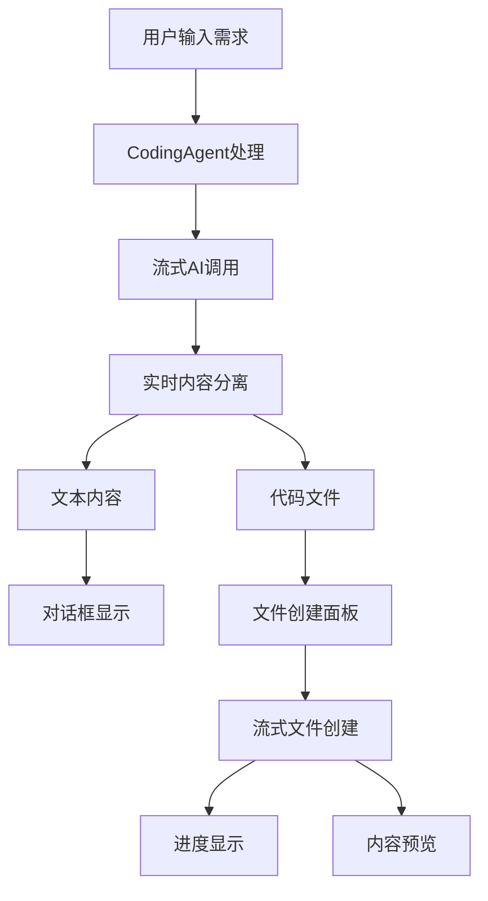

# 文本和代码分离显示实现原理

## 🎯 功能概述

这个功能实现了在AI代码生成过程中，将**文本内容**和**代码文件**分离显示的能力：
- **文本内容**：AI的解释、思考过程显示在对话框中
- **代码文件**：以文件创建面板的形式单独显示，支持实时进度和预览

## 🏗️ 核心架构



## 🔧 核心实现

### 1. 后端分离逻辑 (`lib/agents/coding/agent.ts`)

#### 1.1 流式内容分离

```typescript
private separateTextAndCode(content: string): {
  text: string;
  codeFiles: CodeFile[];
} {
  // 提取代码块
  const codeFiles = this.extractCodeBlocksFromText(content);
  
  // 移除代码块，保留纯文本
  let textOnly = content;
  const codeBlockPatterns = [
    /```[\s\S]*?```/g,  // 标准代码块
    /`[^`\n]*`/g,       // 行内代码
  ];
  
  codeBlockPatterns.forEach(pattern => {
    textOnly = textOnly.replace(pattern, '');
  });
  
  // 清理和格式化文本
  textOnly = textOnly
    .replace(/\n{3,}/g, '\n\n')
    .trim();
    
  return { text: textOnly, codeFiles };
}
```

#### 1.2 流式响应结构

```typescript
yield this.createResponse({
  immediate_display: {
    reply: extractedText, // 🔑 只发送纯文本到对话框
    agent_name: this.name,
    timestamp: new Date().toISOString()
  },
  system_state: {
    metadata: {
      // 🔑 代码文件信息
      hasCodeFiles: extractedCodeFiles.length > 0,
      projectFiles: extractedCodeFiles,
      fileCreationProgress: extractedCodeFiles.map(file => ({
        filename: file.filename,
        status: 'creating',
        progress: Math.min(100, (chunkCount / 10) * 100)
      }))
    }
  }
});
```

### 2. 前端显示组件

#### 2.1 MessageBubble 组件增强

```typescript
// 检测代码文件
const hasCodeFiles = message.metadata?.hasCodeFiles || false;
const codeFiles = message.metadata?.projectFiles || [];
const fileCreationProgress = message.metadata?.fileCreationProgress || [];

// 文件创建状态管理
const [fileCreationStatus, setFileCreationStatus] = useState<Record<string, {
  status: 'pending' | 'creating' | 'created' | 'error';
  progress: number;
}>>({});
```

#### 2.2 文件创建面板

```jsx
{/* 文件创建状态面板 */}
{!actualIsUser && hasCodeFiles && codeFiles.length > 0 && (
  <motion.div className="mt-4 p-4 bg-gray-50 rounded-xl">
    <div className="flex items-center gap-2 mb-3">
      <FolderOpen className="w-4 h-4 text-blue-600" />
      <h4 className="font-semibold">正在创建项目文件</h4>
      <span className="text-sm text-gray-500">
        ({createdCount}/{totalCount})
      </span>
    </div>
    
    {/* 文件列表 */}
    <div className="space-y-2">
      {codeFiles.map(file => (
        <FileCreationItem
          key={file.filename}
          filename={file.filename}
          status={fileStatus[file.filename]?.status || 'pending'}
          content={file.content}
          progress={fileStatus[file.filename]?.progress || 0}
          onFileCreated={() => handleFileCreated(file.filename)}
        />
      ))}
    </div>
  </motion.div>
)}
```

### 3. 文件创建组件 (`FileCreationItem.tsx`)

#### 3.1 流式文件创建模拟

```typescript
useEffect(() => {
  if (status === 'creating' && content) {
    let currentIndex = 0;
    const interval = setInterval(() => {
      if (currentIndex < content.length) {
        const chunkSize = Math.random() * 30 + 5;
        const chunk = content.slice(currentIndex, currentIndex + chunkSize);
        setStreamedContent(prev => prev + chunk);
        
        const newProgress = (currentIndex / content.length) * 100;
        setCurrentProgress(newProgress);
        currentIndex += chunkSize;
      } else {
        clearInterval(interval);
        onFileCreated?.();
      }
    }, 80); // 80ms间隔实现流式效果
    
    return () => clearInterval(interval);
  }
}, [status, content]);
```

#### 3.2 文件状态显示

```jsx
// 状态图标
const getStatusIcon = () => {
  switch (status) {
    case 'pending': return <Clock className="w-4 h-4 text-gray-400" />;
    case 'creating': return <RotatingIcon><FileCode /></RotatingIcon>;
    case 'created': return <CheckCircle className="w-4 h-4 text-green-500" />;
    case 'error': return <AlertCircle className="w-4 h-4 text-red-500" />;
  }
};

// 进度条
{status === 'creating' && (
  <div className="w-full h-1.5 bg-gray-200 rounded-full">
    <motion.div 
      className="h-full bg-blue-500 rounded-full"
      animate={{ width: `${currentProgress}%` }}
    />
  </div>
)}

// 流式内容预览
{showPreview && (
  <div className="bg-gray-900 text-green-400 font-mono">
    {streamedContent}
    <motion.span animate={{ opacity: [1, 0] }}>|</motion.span>
  </div>
)}
```

## 🎯 关键特性

### 1. 内容分离算法

- **正则匹配**：识别各种代码块格式（```language、```filename等）
- **文本清理**：移除代码块后规范化文本格式
- **智能补充**：当文本为空时自动生成项目说明

### 2. 流式体验

- **文本流式**：逐字显示AI的思考过程
- **文件流式**：模拟真实的文件创建过程
- **进度可视化**：实时显示每个文件的创建进度

### 3. 交互体验

- **文件预览**：点击眼睛图标查看文件内容
- **状态指示**：不同颜色和图标表示文件状态
- **总体进度**：显示整个项目的创建进度

## 🔄 数据流

```typescript
// 1. AI生成原始内容
const aiResponse = "我将创建一个React应用...\n```tsx\n// 代码内容\n```";

// 2. 实时分离
const { text, codeFiles } = separateTextAndCode(aiResponse);

// 3. 发送分离后的数据
{
  immediate_display: { reply: text },        // 文本 → 对话框
  metadata: { projectFiles: codeFiles }      // 代码 → 文件面板
}

// 4. 前端分别渲染
- 对话框显示：text内容
- 文件面板显示：codeFiles数组
```

## 🎨 UI/UX 设计

### 1. 视觉分离

- **对话框**：传统聊天界面，显示文本内容
- **文件面板**：独立的卡片区域，显示文件列表
- **颜色编码**：不同状态使用不同颜色（蓝色创建中，绿色完成）

### 2. 动画效果

- **文字打字机效果**：模拟真实的AI思考过程
- **进度条动画**：平滑的进度更新
- **状态转换**：图标旋转、颜色渐变等

### 3. 交互反馈

- **实时状态**：立即反映文件创建状态
- **可展开预览**：按需查看文件内容
- **进度提示**：清晰的数字和百分比显示

## 🚀 使用场景

1. **AI代码生成**：用户描述需求，AI生成完整项目
2. **实时反馈**：用户可以看到AI的思考过程和文件创建进度
3. **继续对话**：文件创建完成后可以继续对话修改代码

## 🧪 测试页面

访问 `/test-text-code-separation` 可以体验完整的功能演示：

- 输入项目需求
- 观察文本和代码的分离显示
- 体验流式文件创建过程
- 查看文件内容预览

## 🔧 技术栈

- **后端**：TypeScript + 流式AI调用
- **前端**：React + Framer Motion + TailwindCSS
- **状态管理**：React Hooks
- **动画**：Framer Motion
- **UI组件**：shadcn/ui

这个实现提供了直观、流畅的用户体验，让用户能够清楚地看到AI的工作过程和结果。 