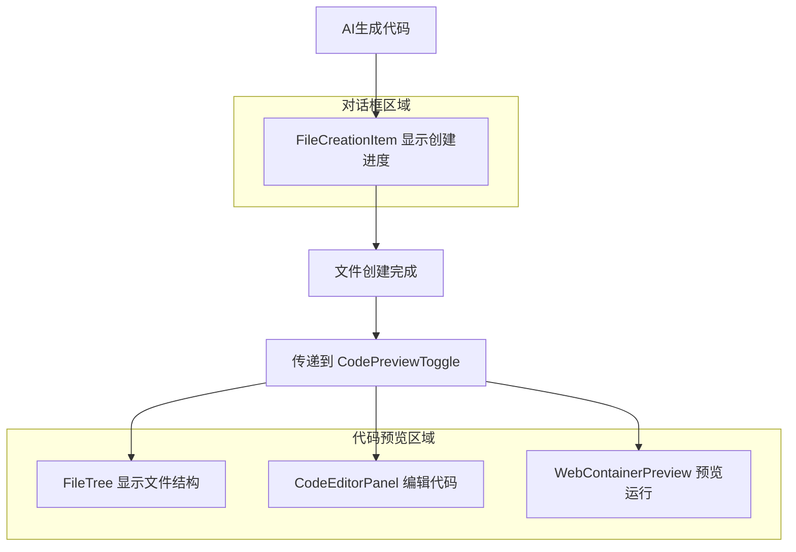

是的！您的理解完全正确。让我分析一下当前的架构和文件流向：
Read file: components/editor/FileTree.tsx
Read file: components/editor/WebContainerPreview.tsx
Read file: components/editor/CodeEditorPanel.tsx
现在让我查看完整的文件流程和集成方式：
Read file: components/editor/README.md
完美！现在我明白了整个文件流程。让我为您详细解释当前的架构和文件流向：

## 🔄 文件创建和流式输出的完整流程

### 📋 当前架构流程



### 🎯 具体实现流程

#### 1. **文件创建阶段** (在对话框中)
- **`FileCreationItem.tsx`**: 显示每个文件的创建进度
- **流式效果**: 模拟真实的文件写入过程
- **进度可视化**: 实时显示文件创建状态

#### 2. **文件传递到编辑器**
- 文件创建完成后，`CodeFile[]` 数组传递给 `CodePreviewToggle`
- 这是主要的代码预览组件，作为整个编辑器的入口

#### 3. **文件树显示** (`FileTree.tsx`)
- 将 `CodeFile[]` 转换为 `FileTreeNode[]` 树状结构
- VS Code 风格的文件浏览器
- 支持文件夹分组和文件类型图标

#### 4. **代码编辑** (`CodeEditorPanel.tsx`)
- Monaco Editor 提供专业级代码编辑
- 语法高亮、智能提示、错误检测
- 实时保存编辑内容

#### 5. **预览运行** (`WebContainerPreview.tsx`)
- 将 React 代码转换为可运行的 HTML
- 支持真实的 WebContainer 环境
- 提供设备预览（桌面/手机）

### 🔧 关键集成点

#### A. 数据流转换
```typescript
// 1. AI生成的CodeFile格式
interface CodeFile {
  filename: string;
  content: string;
  language: string;
  type: 'component' | 'page' | 'styles' | 'config';
}

// 2. 转换为FileTree格式
interface FileTreeNode {
  id: string;
  name: string;
  type: 'file' | 'folder';
  children?: FileTreeNode[];
}

// 3. Monaco编辑器处理
const monacoLanguage = getMonacoLanguage(filename, language);
```

#### B. 组件协作
```typescript
// CodePreviewToggle 作为主控制器
<CodePreviewToggle
  files={codeFiles}          // 从AI生成的文件
  onFileUpdate={handleUpdate} // 编辑更新回调
  onPreview={handlePreview}   // 预览回调
/>

// 内部集成各子组件
<FileTree data={treeData} onFileSelect={setSelected} />
<CodeEditorPanel files={files} onFileUpdate={onUpdate} />
<WebContainerPreview files={files} onPreviewReady={setUrl} />
```

### 🎨 用户体验流程

1. **AI生成阶段**: 用户在对话框看到文件逐个创建
2. **编辑器展示**: 文件创建完成后自动显示在代码预览区
3. **文件浏览**: 通过 FileTree 浏览项目结构
4. **代码编辑**: 点击文件在 Monaco 编辑器中编辑
5. **实时预览**: WebContainer 提供运行预览
6. **可视化编辑**: 通过 StagewiseToolbar 进行可视化修改

### 🚀 技术优势

1. **流式体验**: 从文件创建到预览的无缝衔接
2. **专业工具**: Monaco Editor + WebContainer 的专业级开发环境
3. **可视化编辑**: StagewiseIO 集成提供直观的元素修改
4. **响应式预览**: 支持多设备预览模式
5. **实时同步**: 编辑内容实时反映到预览中

### 🔗 关键连接点

**从 MessageBubble 到 CodePreviewToggle 的数据传递**:
```typescript
// MessageBubble 中的文件创建面板
{hasCodeFiles && (
  <FileCreationPanel files={codeFiles} />
)}

// 文件创建完成后，传递给编辑器
<CodePreviewToggle 
  files={codeFiles}
  isStreaming={false}
/>
```

这个架构确保了从AI生成到用户编辑预览的完整工作流，提供了专业级的代码开发体验！