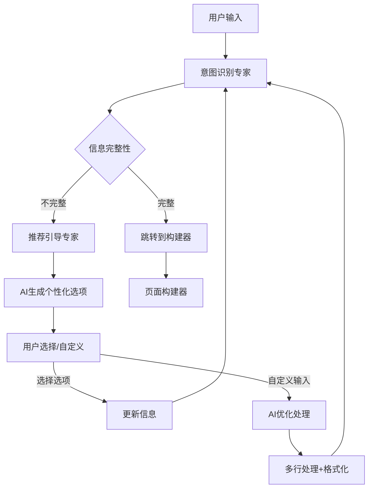

# Welcome Agent - 简化版：专注大模型推荐

## 🚀 系统概述

Welcome Agent 采用**纯大模型驱动**的双Prompt架构，实现智能用户信息收集和个性化推荐。移除了所有本地算法推荐，完全依靠AI进行智能引导。

### 🎯 双Prompt架构优势

#### 🧠 **意图识别专家** (Prompt 1)
- **专注领域**：深度理解用户输入，精准提取结构化信息
- **核心能力**：
  - 语义分析和隐含信息推断
  - 增量信息合并和保持
  - 置信度评估和缺失字段检测
  - 用户输入类型分类

#### 🎨 **推荐引导专家** (Prompt 2)  
- **专注领域**：基于用户画像，智能生成个性化推荐和引导话术
- **核心能力**：
  - AI动态生成个性化选项
  - 自然对话引导
  - 基于上下文的智能推荐
  - 个性化推荐理由

## 🆕 核心功能

### 🤖 **纯AI智能推荐**
- **动态选项生成**：AI根据用户画像实时生成个性化选项
- **上下文理解**：结合已收集信息提供相关性更强的推荐
- **推荐理由说明**：AI提供推荐逻辑，增强用户信任度
- **智能适配**：根据用户类型和目标智能调整推荐策略

### 🔧 **灵活输入支持**
- **AI推荐选项**：智能生成的个性化选项
- **自定义描述**：每个字段都支持用户自定义填写
- **多行输入**：highlight_focus 支持多个亮点输入
- **智能处理**：AI自动优化和格式化用户输入

### 🚀 **智能跳转机制**
- **完成检测**：自动检测信息收集完成状态
- **无缝跳转**：自动跳转到页面构建器
- **状态传递**：完整的用户画像传递给下一模块

## 🔄 处理流程



## 📊 数据结构

### AI推荐响应格式
```typescript
interface WelcomeAgentResponse {
  identified: WelcomeCollectedInfo;
  follow_up: {
    missing_fields: string[];
    suggestions: {
      [field: string]: {
        prompt_text: string;      // AI生成的引导文本
        options: string[];        // AI推荐的选项
        reasoning: string;        // AI推荐理由
      };
    };
  };
  completion_status: 'collecting' | 'ready';
  direction_suggestions: string[];
}
```

### 输入数据支持
```typescript
// 1. 选择AI推荐选项
{ user_role: "前端开发者" }

// 2. 自定义输入（标识）
{ user_role: "✍️ 自己描述我的身份" }

// 3. 多行自定义（highlight_focus）
输入：
"React组件库star数1000+
全国创新创业大赛金奖  
CKA认证+DevOps实践"

输出：
{ highlight_focus: [
  "React组件库star数1000+",
  "全国创新创业大赛金奖", 
  "CKA认证+DevOps实践"
]}
```

## 🚀 使用方法

### 双Prompt处理（核心功能）
```typescript
import { processWelcomeAgent } from './agent';

const result = await processWelcomeAgent(
  "我是一个前端开发者，想要展示我的作品",
  {
    user_role: null,
    use_case: null,
    style: null,
    highlight_focus: []
  },
  1, // 对话轮次
  {
    provider: 'claude',
    includeDebugInfo: false
  }
);

// AI会自动：
// 1. 识别：user_role="前端开发者", use_case="作品展示"
// 2. 推荐下一步：为style字段生成个性化选项
```

### WelcomeAgent类使用
```typescript
import { WelcomeAgent } from './agent';

const agent = new WelcomeAgent();

// 处理用户输入
for await (const response of agent.process(
  { user_input: "我是设计师，想做个人作品集" },
  sessionData
)) {
  console.log(response);
  // AI自动处理并推荐下一步
}
```

### 自定义输入处理
```typescript
// 当用户选择自定义选项时
const customChoice = {
  user_role: "✍️ 自己描述我的身份"
};

// 系统自动引导：
// "请详细描述您的身份背景：
//  • 您的职业或专业领域
//  • 您的工作经验或学习背景
//  • 您的专业技能或特长..."
```

## 🔧 技术架构详解

### 🎯 **纯大模型架构**
```typescript
// 移除了所有本地算法，纯AI驱动
async function processWelcomeAgent(userInput, collectedInfo) {
  // 步骤1：AI意图识别
  const intentResult = await recognizeUserIntent(userInput, collectedInfo);
  
  // 步骤2：AI推荐引导（仅在需要时）
  if (intentResult.completion_status === 'collecting') {
    const guideResult = await generateRecommendationGuide(intentResult);
    return mergeResults(intentResult, guideResult);
  }
  
  return intentResult;
}
```

### 🔄 **状态管理**
```typescript
interface SessionMetadata {
  waitingForCustomDescription?: string;  // 等待自定义描述
  intentData?: WelcomeCollectedInfo;     // 收集的信息
  conversationRound?: number;            // 对话轮次
  completionStatus?: 'collecting' | 'ready';
}
```

### 🚀 **跳转机制**
```typescript
// 信息收集完成时自动返回
{
  intent: 'advance_to_next',
  action: 'redirect_to_builder',
  collected_info: {
    user_role: "前端开发者",
    use_case: "作品展示", 
    style: "现代简约",
    highlight_focus: ["React技能", "开源项目"]
  },
  next_step: 'page_builder'
}
```

## 🎁 核心优势

### 1. **纯AI驱动**
- 🤖 **智能推荐**：所有选项都由AI基于用户画像动态生成
- 🎯 **个性化**：每个推荐都有AI分析的理由和上下文
- 🔄 **自适应**：AI根据对话进展调整推荐策略
- 📊 **精准度高**：大模型理解能力强，推荐更准确

### 2. **架构简洁**
- 🚀 **性能优化**：移除复杂的本地算法，响应更快
- 🔧 **易维护**：代码量减少50%+，逻辑更清晰
- 🛡️ **稳定性强**：降级处理机制，确保系统稳定
- 📝 **类型安全**：完整的TypeScript类型定义

### 3. **用户体验优秀**
- 💬 **对话自然**：AI生成的引导更人性化
- ⚡ **响应迅速**：减少不必要的计算，提升速度
- 🎨 **推荐精准**：基于真实理解的智能推荐
- 🔄 **流程顺畅**：智能跳转，无缝体验

### 4. **开发体验友好**
- 📋 **向后兼容**：保持原有接口，平滑升级
- 🔍 **调试简单**：清晰的AI调用链路和日志
- 📚 **文档清晰**：简化的API和使用说明
- 🧪 **易于测试**：专注核心功能，测试更简单

---

这套**纯大模型驱动**的简化架构，专注于发挥AI的智能优势，提供更加精准、个性化、高效的用户信息收集体验。🎉 