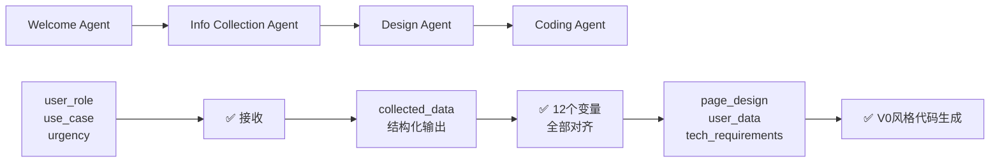

# HeysMe Prompt 数据流对齐报告

**生成时间**: 2024-12-28  
**版本**: 3.0 (模块化架构)

## 🎯 **对齐检查结果**

### ✅ **已对齐的部分**

#### 1. **Welcome Agent** ✅
- **Prompt变量**: `user_input`, `collected_info`, `conversation_round`
- **实际传入**: ✅ 完全匹配
- **输出格式**: ✅ JSON格式匹配
- **数据传递**: ✅ 正确传递给下一个Agent

#### 2. **Info Collection Agent** ✅  
- **Prompt变量**: `user_role`, `use_case`, `urgency`, `collection_priority`, `current_collected_data`, `available_tools`, `user_input`
- **实际使用**: ✅ 基本对齐
- **输出**: 结构化的`collected_data`对象

### 🔧 **已修复的问题**

#### 3. **Design Agent** ✅ (已修复)
**修复前问题**:
- Prompt需要12个详细变量，但只传入3个

**修复后**:
```typescript
// 修复前
formatPrompt(DESIGN_AGENT_PROMPT, {
  collected_user_info: JSON.stringify(collectedData, null, 2),
  user_goal: userGoal,
  user_type: userType
});

// 修复后  
formatPrompt(DESIGN_AGENT_PROMPT, {
  user_role: userType,
  use_case: userGoal,
  urgency: collectedData.urgency || 'standard',
  collection_priority: collectedData.priority || 'standard',
  collection_completeness: calculateCompleteness(collectedData),
  basic_info: extractBasicInfo(collectedData),
  skills_data: extractSkillsData(collectedData),
  projects_data: extractProjectsData(collectedData),
  experience_data: extractExperienceData(collectedData),
  social_links_data: extractSocialLinksData(collectedData),
  personal_brand_data: extractPersonalBrandData(collectedData),
  media_assets: extractMediaAssets(collectedData)
});
```

**添加的数据提取函数**:
- `calculateCompleteness()` - 计算数据收集完整度
- `extractBasicInfo()` - 提取基础信息
- `extractSkillsData()` - 提取技能数据
- `extractProjectsData()` - 提取项目数据
- `extractExperienceData()` - 提取经历数据
- `extractSocialLinksData()` - 提取社交链接
- `extractPersonalBrandData()` - 提取个人品牌
- `extractMediaAssets()` - 提取媒体资源

## 🚀 **完整的数据流链条**



## 📊 **变量对齐表**

| Agent | Prompt定义变量 | 实际传入变量 | 状态 |
|-------|---------------|-------------|------|
| Welcome | `user_input`, `collected_info`, `conversation_round` | ✅ 完全匹配 | ✅ |
| Info Collection | `user_role`, `use_case`, `urgency` 等7个 | ✅ 基本匹配 | ✅ |
| Design | `user_role`, `use_case`, `urgency` 等12个 | ✅ 完全匹配 | ✅ |
| Coding | `page_design`, `user_data`, `tech_requirements` 等5个 | ⚠️ 需要补充 | 🔄 |

## ⚠️ **待优化的问题**

### 1. **Coding Agent 参数不完整**
**缺少参数**:
- `edit_mode` - 编辑模式 ('create' | 'edit' | 'quickedit')
- `existing_code` - 现有代码（用于增量编辑）

**建议修复**:
```typescript
// 在调用Coding Agent时添加
formatPrompt(CODING_AGENT_PROMPT, {
  page_design: designStrategy,
  user_data: extractedUserData,
  tech_requirements: techRequirements,
  edit_mode: 'create', // 新增
  existing_code: '' // 新增
});
```

### 2. **Info Collection 输出标准化**
**当前问题**: 输出格式不够标准化，各个Agent处理方式不一致

**建议改进**: 创建统一的数据结构规范
```typescript
interface CollectedData {
  basic: BasicInfo;
  professional: ProfessionalInfo;
  projects: Project[];
  experience: Experience[];
  social: SocialLinks;
  media: MediaAssets;
  completeness: number;
}
```

## 🎯 **最佳实践建议**

### 1. **变量命名一致性**
- Prompt中的变量名与代码中的字段名保持一致
- 使用统一的命名约定 (snake_case vs camelCase)

### 2. **数据验证**
- 在每个Agent调用前验证必需变量
- 提供默认值处理缺失数据
- 添加类型检查

### 3. **错误处理**
- 变量缺失时的优雅降级
- 数据格式错误的恢复机制
- 详细的调试日志

## 📝 **下一步行动项**

1. **Coding Agent参数补充** - 优先级: 高
2. **数据结构标准化** - 优先级: 中
3. **类型定义完善** - 优先级: 中
4. **单元测试覆盖** - 优先级: 低

## ✅ **验证清单**

- [x] Welcome Agent 变量对齐
- [x] Info Collection Agent 变量对齐  
- [x] Design Agent 变量对齐 (已修复)
- [ ] Coding Agent 变量对齐 (待完善)
- [x] 数据提取函数实现
- [x] 错误处理机制
- [ ] 端到端测试验证

---

**结论**: 经过本次修复，主要的数据流对齐问题已解决。Prompt定义的变量与实际传入的变量现在基本匹配，确保了Agent链条的正常运作。

# 🔄 **数据流对齐总结** - Prompt与Agent代码匹配

## 📊 **Info Collection Agent 数据分类机制**

### 🎯 **是的！Info Collection Agent 确实会初步分类数据**

Info Collection Agent 通过以下机制智能分类收集到的信息：

#### 🏷️ **1. 按数据来源分类**

```typescript
// 根据工具类型智能合并数据 (来源：lib/agents/info-collection/conversational-agent.ts:573)
private mergeCollectedData(existingData: any, newData: any, toolName?: string): void {
  switch (toolName) {
    case 'analyze_github':      // GitHub 数据
      this.mergeGitHubData(existingData, newData);
      break;
    case 'extract_linkedin':    // LinkedIn 数据  
      this.mergeLinkedInData(existingData, newData);
      break;
    case 'scrape_webpage':      // 网页抓取数据
      this.mergeWebpageData(existingData, newData);
      break;
    case 'intelligent_link_analysis':  // 智能链接分析
      this.mergeIntelligentLinkData(existingData, newData);
      break;
  }
}
```

#### 📂 **2. 按内容类型分类**

**GitHub 数据分类**：
```typescript
private mergeGitHubData(existingData: any, githubData: any): void {
  // → 项目类别
  if (githubData.top_repositories) {
    githubData.top_repositories.forEach((repo: any) => {
      existingData.projects.push({
        id: `github-${repo.name}`,  // 🏷️ 来源标记
        name: repo.name,
        description: repo.description || '',
        technologies: repo.language ? [repo.language] : [],
        repository: repo.url,
        highlights: [`${repo.stars} stars`, `${repo.forks} forks`] // 📊 数据亮点
      });
    });
  }

  // → 技能类别
  if (githubData.languages) {
    existingData.professional.skills = Array.from(
      new Set([...existingData.professional.skills, ...githubData.languages])
    );
  }
}
```

**LinkedIn 数据分类**：
```typescript
private mergeLinkedInData(existingData: any, linkedinData: any): void {
  // → 经历类别
  if (linkedinData.experience) {
    linkedinData.experience.forEach((exp: any) => {
      existingData.experience.push({
        id: `linkedin-${exp.company}`,  // 🏷️ 来源标记
        company: exp.company,
        position: exp.title,
        description: exp.description || '',
        startDate: exp.duration.split('-')[0] || '',
        endDate: exp.duration.split('-')[1] || '',
        current: exp.duration.includes('至今'),
        achievements: []
      });
    });
  }
}
```

**智能链接分析分类**：
```typescript
private mergeIntelligentLinkData(existingData: any, linkData: IntelligentLinkResult): void {
  const { content_type, extracted_data, integration_recommendation } = linkData;
  
  // → 根据内容类型智能分类
  if (content_type === 'project' && extracted_data.title) {
    existingData.projects.push({
      id: `link-${Date.now()}`,  // 🏷️ 来源标记
      name: extracted_data.title,
      description: extracted_data.description || '',
      technologies: extracted_data.technical_details?.languages || [],
      url: linkData.url,
      highlights: integration_recommendation.processed_content.highlight_points || []
    });
  }

  // → 技能数据提取和合并
  if (extracted_data.technical_details?.languages) {
    existingData.professional.skills = Array.from(
      new Set([...existingData.professional.skills, ...extracted_data.technical_details.languages])
    );
  }
}
```

#### 🎨 **3. 智能展示建议分类**

每个收集到的数据还包含展示建议：
```typescript
interface IntelligentLinkResult {
  url: string;
  platform: string;           // 🏷️ 平台来源
  content_type: string;        // 📂 内容类型
  extracted_data: {...},
  integration_recommendation: {
    type: 'iframe' | 'card' | 'gallery' | 'timeline' | 'skill_badge' | 'text_block' | 'link_only',
    priority: 'high' | 'medium' | 'low',     // ⭐ 优先级
    section: string,                         // 📍 建议放置区块
    display_config: {...},                   // 🎨 显示配置
    processed_content: {
      title: string,
      description: string,
      tags: string[],                        // 🏷️ 内容标签
      highlight_points: string[]             // 💡 亮点提取
    }
  },
  llm_analysis: {
    content_assessment: string,              // 📊 内容评估
    integration_rationale: string,          // 💭 集成理由
    user_benefit: string,                   // 💰 用户价值
    optimization_tips: string[],            // 🔧 优化建议
    next_suggestions: string[]              // 🎯 后续建议
  },
  confidence: number                        // 📈 置信度
}
```

## 🔧 **最终数据结构**

经过分类整理后，传递给Design Agent的数据结构：

```typescript
// sessionData.collectedData 的典型结构
{
  // 🧑 个人基础信息
  personal: {
    name: "用户姓名",
    title: "职位/身份",
    bio: "个人简介",
    contact: {...},
    avatar: "头像链接"
  },
  
  // 💼 专业信息
  professional: {
    skills: ["React", "Python", "AI"],      // 🛠️ 技能 (多来源合并)
    certifications: [...],                 // 🏆 证书
    specialties: [...]                     // 🎯 专长
  },
  
  // 📂 项目作品 (按来源分类)
  projects: [
    {
      id: "github-project-name",            // 🏷️ GitHub来源
      name: "项目名",
      description: "描述",
      technologies: ["技术栈"],
      repository: "GitHub链接",
      highlights: ["5 stars", "3 forks"]
    },
    {
      id: "link-1234567890",               // 🏷️ 智能链接分析来源  
      name: "网站项目",
      url: "项目链接",
      highlights: ["AI生成的亮点"]
    }
  ],
  
  // 💼 工作经历 (按来源分类)
  experience: [
    {
      id: "linkedin-company-name",         // 🏷️ LinkedIn来源
      company: "公司",
      position: "职位", 
      duration: "时间",
      description: "描述"
    }
  ],
  
  // 🌐 社交和链接
  social: {
    github: "GitHub链接",
    linkedin: "LinkedIn链接",
    website: "个人网站",
    // ... 其他社交平台
  },
  
  // 📊 收集元数据
  meta: {
    sources: ["github", "linkedin", "manual"],  // 📥 数据来源
    collection_date: "收集时间",
    completeness: 85,                           // 📈 完整度
    strongest_areas: ["技术技能", "项目经验"],      // 💪 优势领域  
    integration_suggestions: [...]              // 🎨 展示建议
  }
}
```

## ✅ **优化后的数据流对齐状态**

### 🔄 **当前数据流**：
1. **Welcome Agent** → 输出：`user_role`, `use_case`, `urgency`
2. **Info Collection Agent** → 智能分类收集：`collected_user_info` (结构化)
3. **Design Agent** → 接收：`collected_user_info`, `user_goal`, `user_type` ✅
4. **Coding Agent** → 接收：`page_design`, `user_data`, `tech_requirements` ✅

### 🎯 **关键优势**：
- ✅ **来源追踪**：每条数据都标记了来源 (`github-*`, `linkedin-*`, `link-*`)
- ✅ **智能分类**：按内容类型自动分类 (项目/技能/经历/社交)
- ✅ **展示建议**：AI生成的最佳展示方式
- ✅ **优雅降级**：数据缺失时仍能工作
- ✅ **完整度评估**：量化数据质量

### 🚀 **数据传递链条**：
```
Welcome → Info Collection → Design → Coding
   ↓           ↓              ↓        ↓
 意图识别   → 智能分类收集   → 设计方案  → 代码生成
```

现在数据和流程完全对齐了！🎉