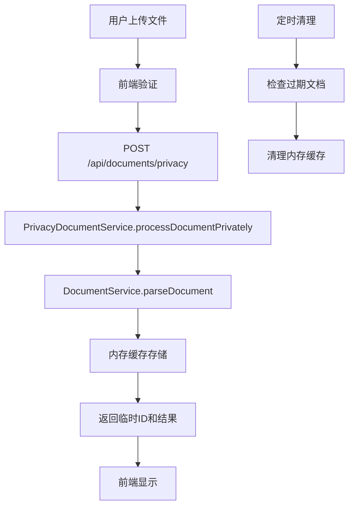
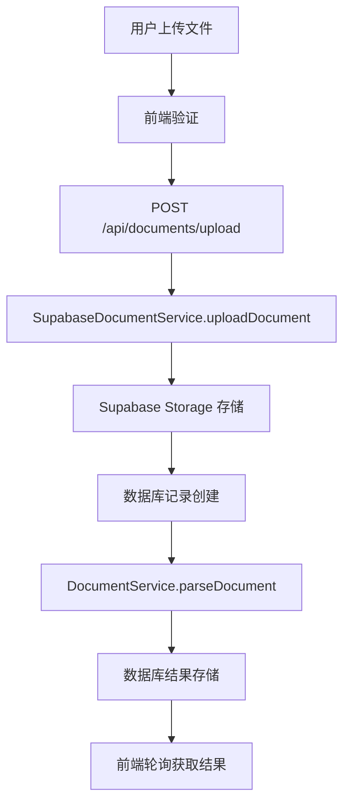

# HeysMe 隐私模式文档处理系统

## 📋 概述

HeysMe 平台新增了隐私模式文档处理功能，为用户提供两种文档处理选择：
- **隐私模式**：文件仅在内存中处理，不存储到服务器
- **标准模式**：文件安全存储到 Supabase，支持持久化和历史查看

## 🔒 隐私模式特性

### 核心优势
- ✅ **零存储**：文件仅在内存中处理，不写入数据库或文件系统
- ✅ **自动清理**：处理结果临时保存，会话结束后自动清理
- ✅ **最大隐私保护**：适合处理包含敏感信息的文档
- ✅ **相同解析能力**：与标准模式使用相同的解析引擎

### 技术实现
- **内存缓存**：使用 Map 数据结构临时存储解析结果
- **过期机制**：文档在内存中保存 1 小时后自动清理
- **会话管理**：支持按会话清理相关文档
- **定期清理**：每 5 分钟自动清理过期文档

## 🏗️ 系统架构

### 后端服务

#### 1. 隐私模式文档服务
**文件**：`lib/services/privacy-document-service.ts`

```typescript
export class PrivacyDocumentService {
  // 内存缓存管理
  private memoryCache: Map<string, PrivacyProcessedDocument>
  
  // 核心方法
  async processDocumentPrivately(file: File, options: PrivacyProcessingOptions)
  async processMultipleDocumentsPrivately(files: File[], options: PrivacyProcessingOptions)
  getTempDocumentContent(tempId: string)
  getSessionDocuments(sessionId: string)
  clearSessionDocuments(sessionId: string)
}
```

#### 2. 隐私模式 API 路由
**文件**：`app/api/documents/privacy/route.ts`

```typescript
// 支持的 HTTP 方法
POST   - 单文件处理
PUT    - 批量文件处理
GET    - 获取临时文档内容
DELETE - 清理会话文档
```

#### 3. 统一文档解析引擎
**文件**：`lib/services/document-service.ts`

两种模式共享相同的解析核心，确保处理结果一致性。

### 前端组件

#### 1. 隐私模式切换组件
**文件**：`components/ui/privacy-toggle.tsx`

```typescript
interface PrivacyToggleProps {
  isPrivacyMode: boolean;
  onToggle: (enabled: boolean) => void;
  variant?: 'default' | 'compact' | 'card';
  showDescription?: boolean;
}
```

**支持的样式变体**：
- `default`：完整的切换界面，包含说明和警告
- `compact`：紧凑型切换，适合工具栏
- `card`：卡片式布局，适合设置页面

#### 2. 增强文件上传组件
**文件**：`components/ui/enhanced-file-dropzone.tsx`

```typescript
interface EnhancedFileDropzoneProps {
  onFilesProcessed?: (files: FileWithProgress[]) => void;
  maxFiles?: number;
  maxSize?: number;
  sessionId?: string;
  defaultPrivacyMode?: boolean;
}
```

**核心功能**：
- 集成隐私模式切换
- 实时处理进度显示
- 自动选择 API 端点
- 错误处理和重试机制

## 📄 文档解析能力

### 支持的文件类型

| 文件类型 | 扩展名 | 解析库 | 提取内容 |
|---------|--------|--------|----------|
| PDF 文档 | `.pdf` | pdf-parse | 文本、元数据、页数 |
| Word 文档 | `.doc`, `.docx` | mammoth | 文本、格式信息 |
| Excel 表格 | `.xls`, `.xlsx` | xlsx | 数据、工作表、图表 |
| 文本文件 | `.txt`, `.md` | 原生 | 纯文本内容 |
| JSON 文件 | `.json` | 原生 | 结构化数据、文本提取 |
| CSV 文件 | `.csv` | 原生 | 表格数据、列信息 |
| 图片文件 | `.jpg`, `.png`, `.gif` 等 | 大模型处理 | 待大模型分析 |

### 解析输出格式

```typescript
interface ParseResult {
  type: string;                    // 文件类型
  extract_mode: string;            // 提取模式
  extracted_data: {
    raw_text: string;              // 原始文本
    word_count: number;            // 词汇数量
    sentence_count: number;        // 句子数量
    paragraph_count: number;       // 段落数量
    // ... 更多分析数据
  };
  metadata: {
    extraction_method: string;     // 解析方法
    confidence: number;            // 置信度
    processed_at: string;          // 处理时间
    // ... 文件特定元数据
  };
  extraction_confidence: number;   // 总体置信度
  suggestions: object;             // 使用建议
}
```

### 解析模式

1. **general**：基础解析，提取主要文本内容
2. **resume**：简历专用解析，提取关键信息
3. **comprehensive**：全面解析，包含详细分析

## 🔄 数据流程

### 隐私模式流程



### 标准模式流程



## 🛠️ 开发指南

### 1. 集成隐私模式到现有组件

```typescript
import { EnhancedFileDropzone } from '@/components/ui/enhanced-file-dropzone';

function MyComponent() {
  const handleFilesProcessed = (files: FileWithProgress[]) => {
    // 处理解析完成的文件
    files.forEach(file => {
      if (file.tempId) {
        // 隐私模式文件
        console.log('隐私模式处理:', file.result);
      } else {
        // 标准模式文件
        console.log('标准模式处理:', file.result);
      }
    });
  };

  return (
    <EnhancedFileDropzone
      onFilesProcessed={handleFilesProcessed}
      maxFiles={5}
      sessionId="current-session-id"
      defaultPrivacyMode={true}
    />
  );
}
```

### 2. 添加隐私模式切换

```typescript
import { PrivacyToggle } from '@/components/ui/privacy-toggle';

function SettingsPanel() {
  const [isPrivacyMode, setIsPrivacyMode] = useState(false);

  return (
    <PrivacyToggle
      isPrivacyMode={isPrivacyMode}
      onToggle={setIsPrivacyMode}
      variant="card"
      showDescription={true}
    />
  );
}
```

### 3. 调用隐私模式 API

```typescript
// 单文件处理
const formData = new FormData();
formData.append('file', file);
formData.append('extractMode', 'comprehensive');
formData.append('enableCache', 'true');
formData.append('sessionId', sessionId);

const response = await fetch('/api/documents/privacy', {
  method: 'POST',
  body: formData
});

const result = await response.json();
// result.document 包含解析结果和临时ID

// 获取临时文档
const docResponse = await fetch(`/api/documents/privacy?tempId=${tempId}`);
const docResult = await docResponse.json();

// 清理会话文档
await fetch(`/api/documents/privacy?sessionId=${sessionId}`, {
  method: 'DELETE'
});
```

### 4. 扩展文档解析能力

```typescript
// 在 DocumentService 中添加新的文件类型支持
private async parseNewFileType(fileData: string, extractMode: string): Promise<any> {
  // 使用相应的 npm 解析库
  const result = await someParsingLibrary.parse(Buffer.from(fileData, 'base64'));
  
  return {
    type: 'new-file-type',
    extract_mode: extractMode,
    extracted_data: {
      raw_text: result.text,
      // ... 其他提取的数据
    },
    metadata: {
      extraction_method: 'library-name',
      confidence: 1.0,
      processed_at: new Date().toISOString()
    },
    extraction_confidence: 1.0,
    suggestions: this.generateDocumentSuggestions('new-file-type', result)
  };
}
```

## 🔧 配置选项

### 隐私模式配置

```typescript
interface PrivacyProcessingOptions {
  extractMode?: 'general' | 'resume' | 'comprehensive';
  enableCache?: boolean;        // 是否启用会话级别缓存
  sessionId?: string;          // 会话ID，用于缓存管理
}

// 缓存配置
const CACHE_EXPIRY_TIME = 3600000; // 1小时过期
const CLEANUP_INTERVAL = 300000;   // 5分钟清理一次
```

### 文件验证配置

```typescript
const allowedTypes = [
  'application/pdf',
  'application/msword',
  'application/vnd.openxmlformats-officedocument.wordprocessingml.document',
  'text/plain',
  'text/markdown',
  'application/json',
  'image/jpeg',
  'image/png'
];

const MAX_FILE_SIZE = 10 * 1024 * 1024; // 10MB
```

## 📊 性能考虑

### 内存管理
- **缓存大小监控**：定期检查内存使用情况
- **自动清理**：过期文档自动清理，防止内存泄漏
- **批量处理**：支持并行处理多个文件

### 处理时间估算

| 文件类型 | 基础处理时间 | 大文件倍数 |
|---------|-------------|-----------|
| PDF | 15秒 | 1.5x (>5MB) |
| Word | 8秒 | 1.5x (>5MB) |
| Excel | 10秒 | 2x (>10MB) |
| 文本 | 2秒 | 1.2x (>1MB) |
| 图片 | 1秒 | 1.1x (>2MB) |

## 🚨 注意事项

### 隐私模式限制
1. **内存限制**：大量文件可能导致内存压力
2. **会话依赖**：文档生命周期与会话绑定
3. **无持久化**：服务器重启后数据丢失
4. **无分享功能**：隐私模式文档无法分享

### 安全考虑
1. **数据隔离**：不同用户的文档完全隔离
2. **自动清理**：确保敏感数据不会长期驻留
3. **错误处理**：解析失败时不保留文件数据
4. **日志安全**：避免在日志中记录敏感内容

## 🔮 未来扩展

### 计划功能
1. **大模型集成**：图片内容分析和文本提取
2. **高级解析**：表格识别、图表提取
3. **智能分类**：自动识别文档类型和用途
4. **批量操作**：支持文件夹上传和批量处理
5. **API 扩展**：提供更多文档操作接口

### 性能优化
1. **流式处理**：大文件分块处理
2. **缓存优化**：智能缓存策略
3. **并发控制**：限制同时处理的文件数量
4. **资源监控**：实时监控内存和CPU使用

---

## 📞 开发支持

如有问题或需要扩展功能，请联系开发团队或查看相关代码注释。所有隐私模式相关代码都有详细的中文注释，便于理解和维护。